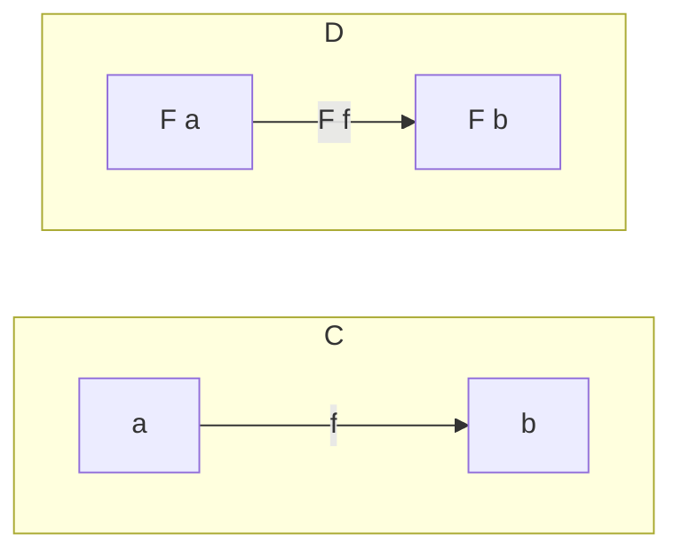

# Functors

Functor is a mapping between two categories. It maps both objects and morphisms
from one category to the other.

Here's an example of morphism F that is a mapping between categories
C and D:



F maps:

- `a` to `F a`
- `b` to `F b`
- `f` to `F f`

A category would translate to a generic type like `List<T>` in C#. A
`Select` method on it allows us to go from `List<T>` to `List<U>`.
`List<T>` is a functor.

In general, generics are often candidates for functors, they just need
to adhere to functor laws. It doesn't mean though that only generic types
fall under the functors umbrella.

:::tip[Endofunctor]
The example of `List<T>.Select` is actually en **endofunctor**,
since we move from `List<T>` to `List<U>. The `List` type
is the same, only the generic type argument changes.
:::

## Functor Laws

1. Mapping an indentity function returns the functor unchanged.

    ```csharp
    var input = new[] {1, 2, 3};
    var identity = (int n) => n;
    var result = input.Select(identity);

    // input and result are the same
    ```

2. if you have two functions, `f` and `g`, then mapping over one after the other
   should be the same as mapping over the composition of `f` and `g`.

    ```csharp
    var input = new[] {1, 2, 3};
    var f = (int n) => n + 1;
    var g = (int n) => n.ToString();

    var result1 = input.Select(f).Select(g);
    var result2 = input.Select(n => g(f(n)));

    // result1 and result2 are the same
    ```

## Examples

Examples of functors include:

- List
- Maybe
- Tree
- Either