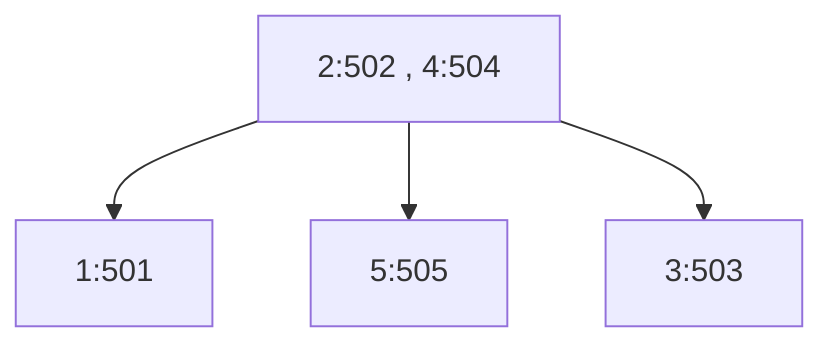
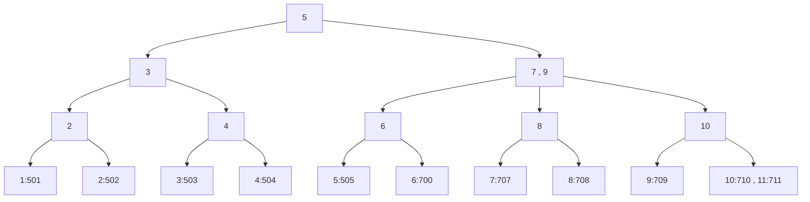

# B-Tree and B+Tree

B Trees are used for [indexes](./db-index), and those are used to circumvent heap scans, which are
expensive.

## Full Table Scans

The Full Table Scan is the reason why B-Tree was created. We don't want Full Table Scans, because
they incur high I/O cost, which leads to worse performance. We need a way to reduce the search
space.

For full table scans to return data in acceptable time, database engines apply "tricks", such as
spinning up multiple threads that scan different portions of the table (different pages).

## B-Tree

A B-Tree has a degree _m_. It's the number of child nodes, a single node may have. A single node has
up to _(m-1)_ elements. Each element has a key and a value. The key is the value we're searching for
(what the index was created on). The value is a pointer to the row on the
heap. A single node represents one page of rows.

:::tip
Here's a general overview of B-Trees from algoritmic side of view: [B-Trees](/programming/algorithms/tree#b-tree).
:::

An example:

Database:

| TupleID | UserId | Name   | Age |
| ------- | ------ | ------ | --- |
| 501     | 1      | Maryem | 26  |
| 502     | 2      | James  | 17  |
| 503     | 3      | Anne   | 20  |
| 504     | 4      | John   | 54  |
| 505     | 5      | Juliet | 33  |

B-Tree:

In this example, we have 5 rows. Each node represents one page on the disk.
The TupleID refers to the way how Postgres stores data, it assigns TupleID to each row.
The DB engine knows how to get to appropriate page for a given TupleID.
The fact that the rows in a single page do not have consecutive IDs might suggest
that the rows were inserted out of order in regards to ID.

:::tip
A visualization of B-Tree operations can be found [here](https://www.cs.usfca.edu/~galles/visualization/BTree.html)
:::

The "continuity" of the indexed value is important for performance. The way how B-Tree is organized
incurs performance cost of inserting values out of order. If the value needs to be inserted
somewhere in the middle of an existing tree, some part of the tree will need to be rebuild.

Limitations:

- range queries (e.g. `A>10 AND A<20`) are slow. The traversal has to jump up and down in the tree to
  find all the relevant nodes.

## B+Tree

B+Tree was created to solve some of the issues o B-Trees.

B+Trees are very similar to B-Trees. The differences are:

- Keys are stored only in the internal nodes (not root, not leaves).
- Values are stored only in the leaf nodes. Internal nodes are smaller because of that. They can fit
  more elements.
- Leaf nodes are linked, so there's no need to jump back up to find consecutive keys. That solves
  the slowness of range queries in B-Trees. We just need to traverse the tree once to find one end of
  the query, and then we follow the linked list till we find the other end.

An example:

(mermaid diagram can't show it nicely, but the leaf nodes are linked like a linked list)

This example is huge simplification in regards to page contents. Normally, a page would not contain
just one row, there'd be much more of them realisticaly.

## Usage

Databasese usually go for B+Trees due to its improvements over B-Trees.
Note that in clustered index, the values in leafs of B+Trees are gonna be effectively the entire
rows.

Nowadays, many databases do not use any form of B-Tree, mostly due to write inefficiencies
(rebuilding the tree when inserting out of order). Instead, they use LSM Trees, which are more
optimized for writes.

B-Trees are used by:

- Microsoft SQL Server
- Postgres
- MySQL
- Mongo
- Couchbase

LSM is used by:

- Cassandra
- Google Cloud BigTable
- elasticsearch
- influxdb
- LevelDB (Google's level originally introduced LSM)
- RocksDB (Facebook's RocksDB is a fork of LevelDB, with many improvements)
