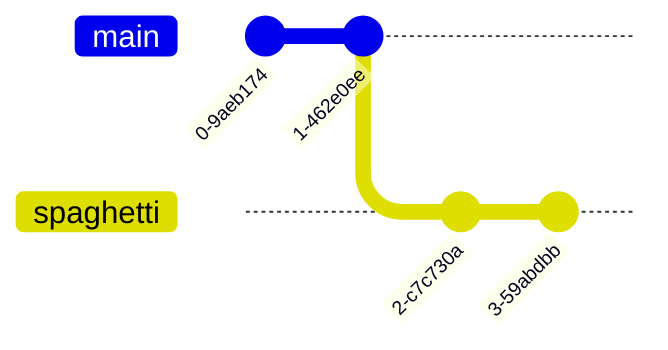

import { Image } from 'astro:assets';

# Git

## Useful Tips

- when working on a feature branch, it's a good idea to rebase on top of latest
  version of source branch to keep the history of feature branch clean (without
  merges) (`git rebase develop`). `git pull --rebase` is useful in the above
  situation. It automates the whole thing.
- Git is able to automatically understand that some file got renamed, without an
  explicit `git mv`
- `git mv` automatically adds a change to the Staging Area (index).
- `git rebase -i` is powerful - the commits can be reordered!
- if something goes wrong during a rebase, we can recover our previous state by
  moving the branch to the previous HEAD (`git reflog HEAD` might help to find
  the SHA-1 of the old HEAD commit), before it's garbage collected

### Commit Targetting

Useful for `git show <COMMIT>`:

- `HEAD^` - parent
- `HEAD^^` - parent of the parent
- `HEAD~3` - 3rd commit behind `HEAD` (`HEAD~0` = `HEAD`)
- `HEAD~2^2` - if the 2nd commit behind HEAD is a merge commit, it has 2
  parents. This is how we refer to the second parent.

## Cheat Sheet

https://cheatography.com/loreno10/cheat-sheets/git/

## Function

Git can be seen as a set of layers:

#### Persistent key-value map

Git stores objects. Key is SHA-1, and the value is the contents.

#### Content tracker

Each commit is a point in the history. Git creates a kind of file system built
with objects. Different commits point to a different "shape" of our repository.

## Internals

### Objects

`.git/objects` folder is a database of all Git objects.

There are 4 types of objects in Git:

- blobs
- trees
- commits
- annotated tags

Every object in Git has its SHA-1.

In example, if a commit is created, a new file is created in `.git/objects`
(name is the same as commit's SHA-1):

```
tree 4e9e0b052b2f0c5aaeabd215eacbb62c6ea299bf
author Marcin Jahn <marcin.jahn@pl.abb.com> 1607885340 +0100
committer Marcin Jahn <marcin.jahn@pl.abb.com> 1607885340 +0100

First commit
```

It contains a basic info about a commit, including the SHA-1 of a **tree** - a
directory object in Git. If the commit was not first in history, there would
also be a *parent* information (SHA-1 of a parent commit(s)). If we look at the
contents of the tree object (with `git cat-file -p
4e9e0b052b2f0c5aaeabd215eacbb62c6ea299bf`) we'd get:

```
100644 blob 8954f2439cae536b9b35ac39e8d173b90f979ca4  menu.txt
040000 tree c888eb2c751094817564e75b0f32fb366e719607  recipes

```

The root folder of our repo contains two things: `menu.txt` and `recipes`
directory. These 2 are shown above. **Blob** is an object that represents a
file. Contents of `menu.txt` blob:

```
Put your recipes here
```

This is exactly the same content as the file in our repo. Blobs store just the
contents of the file. They do not store file's name or its permissions. These
are stored in the tree that points to that blob.

> The commit points to a tree object, which represents the state of the repo for
> this commit. A tree than points to its contents: files (blobs) and directories
> (trees).

If there were 2 different files with the same content, just one object would be
created. It would be pointed to twice (by different trees, if different
directories contained these files).

An example of Git objects:


There are 2 commits (red). In the last commit, one file (`menu.txt`) was
modified. Because of that, a new object was created for that new state of this
file. Since the `recipes` directory stayed the same, both commits point to the
same object.

Git might also, for optimization, work a bit differently if files are big. When
we change just a line of such a file, Git will store only the difference,
instead of copying the entire file into a new blob object. However, for
simplicity, it can be ignored.

After cloning a project from a remote, the `objects` directory will not contain
the individual objects. Instead, there will be a "pack" containing all the
objects.

#### Branches

Branches are stored in `.git/refs/heads`. Each branch has its file, and contains
just the SHA-1 of the commit it points to. A branch is just a reference to some
commit.

#### Internal Commands

`git cat-file -p <SHA-1 of an object>` - displays the object's content `git
count-objects` - show how many objects there are in the repo

#### Uniqueness

SHA-1 of a commit is unique globally. There might be collision, but the chance
for that is very low. The SHA-1 of blobs or trees is not unique, because it is
dependent on the file contents only. Commit's SHA-1 depends from the author,
timestamp.

#### Merge files

When there's an ongoing merge (i.e., conflict), `.git` directory will contain
some `MERGING_*` files, which inform what we are merging.

### HEAD file

`.git/HEAD` contains the path to the current branch, i.e. `ref:
refs/heads/master`. HEAD is a reference to a branch. When checking out another
branch, the only thing that changes is the content of the `.git/HEAD` file.

If we checkout a commit ("detached" HEAD), instead of a branch, `.git/HEAD` will
contain the SHA-1 of that commit.

#### Detached HEAD

We can still commit in the detached state. If we then switch back to some
branch, these comits will be unreachable. After some time Git will remove them
from the `objects` database. We can still use these commits until that happens.

### Index

`.git/index` contains **Staging Area** changes. It's a binary file, the content
is not readable.

## Rebase

Rebase moves commits around. It can do a fast-forward, just like `merge`. I.e.,
in this case, `git rebase spaghetti` and `git merge spaghetti` will have the
same result - "master" will be moved to "spaghetti" commit.



### Commits

When rebasing commits, NEW commits are created that are mostly the same as the
original ones. Parents change, and this changes the SHA-1 - new objects will be
created as a result. The original commits will be deleted at some point from the
`objects` database by Git (garbage collection).

## Tags

There are "normal" and "annotated" tags. Tags are similar to branches, with one
difference - branches move with commits, tags do not move.

### Normal tags

They are just like a label. They are stored in `.git/refs/tags` and contain just
the SHA-1 of the commit that they point to. Such a tag could easily be
transformed in to a branch, just by moving it to `.git/refs/heads`, where all
branches are stored.

### Annotated tags

They contain more information - a date, an author, a description. They are
stored as an object.

## Remotes

`.git/config` contains the remotes configuration.

### Pull

`git pull` is a combination of `git fetch` and `git merge`.

## Adding a part of file

It might happen that we modify a few lines of a file, but we do not want to add
all of it to the commit. We want to add just a part of these changes. `git add
-p <file>` does that. It splits the file into **hunks**. Git asks about each
hunk and we have to decide to include it (`y`) or not (`n`). We might also
decide to split the hunk into a smaller one (`s`) and decide for each of the
smaller hunks separately. After it's done, we may commit.

`-p` = `--patch`

A few other git commands have the `--patch` option: `add`, `checkout`, `stash`,
`reset`, ...

## Useful Commands

`git reflog` - show the log of things happening in the repo (switching branches,
new commits, rebases, etc.) `git reflog HEAD` - show the log of where `HEAD` was
`git show <SHA-1>` - show any file by its SHA-1 `git config --global
--replace-all core.pager "less -iXFR"` - displays `git log` (and others) like
`cat`, instead of `less` (content does not disappear). `git show <COMMIT>` -
shows changes introduced by a commit `git blame <FILE>` - shows line-by-line,
who changed each line and when. `^` means that the line was there since the
beginning. `git revert <COMMIT>` - creates a commit that does the opposite
operations than the supplied commit. It can also revert multiple commits.
Reverting merge commits is not so straightforward, and requires a bit different
approach

### Reset

`git reset` does different things in different contexts. `git reset` moves the
branch to another commit. It can work in different modes:

`--hard` - it sets the working directory and index to the state of the new
commit - useful when working directory changes do not make sense and we want to
get back to where we started from `--mixed` - (default) - it does not change the
working directory, only sets the index to the new commit - usefult when we have
some changes staged, but we want to unstage them. It optionally accepts a path
to a file that should be "reset". `--soft` - just moves the branch, does not
modify working directory, nor index - useful when we want to move back to some
commit from the past, modify some stuff, and commit again (rewriting history)

Examples: 

```sh
git reset HEAD menu.txt
git reset --hard HEAD
```

### Switch

Alternative for `checkout`. Switches branch. Use `-c` to create one.

### Restore

Alternative for `checkout`. Restores files from the past.

### Remove file from history

It is possible to remove some file entirely from Git history as if it never
existed.

```sh
git filter-repo --path menu.txt --invert-paths
```

Entire history gets rewritten, new commits are created. This command might need
to be installed on its own.

### Bisect

`git bisect` allows to find a commit that introduced some issue into the
codebase. It can work manually or automatically. We specify the range of commits
that the tool will look in. It will check each commit one-by-one, until it finds
the "bad" one.

## Attributes

`gitattributes` file allows to specify various configs.

### Clean and Smudge filters

Git is able to remove sensitive data from specified files when commiting. It is
also able to set the sensitive values when checking out the repository. It's
done using **Git Attributes*.

## Submodules

Submodules is a way to share code between repos. One repo may have many
submodules that it makes use of.

### Adding submodule

There should be some directory for submodules (i.e., `external/`).

```sh
git submodule add <REPO_URL> external/submodule1
```

Submodule will be cloned into the selected path. A new file - `.gitmodules` -
will be created, listing all submodules.

### More information about submodules

By default, `git status` and `git diff` do not show information about
modifications to submodules.

```sh
git config --global status.submoduleSummary true
git config --global diff.submodule log
```

Now, `git status` will give more information (i.e., submodule added).
Additionally, `git diff` will show info about submodules.

### Cloning a repo with submodules

```sh
git clone <REPO>
git submodule init
git submodule update
```

or

```sh
git clone --recursive <REPO>
```

The second way will work also if there are nested submodules.

### Syncing repo with submodules

When working with a team, the following commands allow to make sure that our
whole repo is in sync with remote:

```sh
git pull
git submodule sync --recursive
git submodule update --init --recursive
```

### Updating submodule

When we update a submodule, we need to push it, together with the "main" repo
that contains this submodule. By default, we need to do it manually. There is a
config that automates that:

```sh
git config --global push.recurseSubmodules on-demand
```

Now, when pushing main repo, also submodules will be pushed.

## Hooks

There are client-side and server-side hooks that can be added. They will eb run
automatically on speicified actions. By default, client-side hooks are stored in
`.git/hooks`. Therefore they are not share with the team. This can be chaged via
configuration.