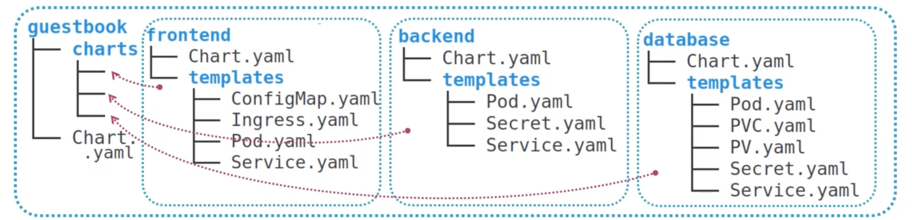

# Helm

**Helm** is a package manager for Kubernetes. The packages themselves are called
**Charts**. Installed chart is called a **Release**.

## Why?

- Typically, K8s applications require multiple objects: deployments, services,
  ingresses, storage, configs, etc. Usually, these are defined in separate YAML
  files.
    - we'd like to treat these objects "atomically" - they are all parts of one app
    - the order of objects creation might matter (e.g. config before deployment)
    - versioning is not straightforward - we have to remember the differences
      between two versions and manually apply them

With Helm, we get the following:

- We treat the app as a single entity, "forgetting" that it consists of multiple
  objects - an app in a **package**
- Packages are versioned, making it much easier to upgrade/downgrade apps
- Templates allow extracting variables from YAML files for customizability
- Management of dependencies

## Helm Charts

A **Chart** is a package.

### Structure

A chart is a folder. It can be compressed as an archive.

```
my-chart
|-- charts (optional)
|---- mongodb-7.8.4.tgz
|-- Chart.yaml
|-- README.md
|-- requirements.yaml (optional)
|-- templates
|---- deployment.yaml
|---- _helpers.tpl
|---- ingress.yaml
|---- service.yaml
|---- NOTES.txt
|-- values.yaml
|-- values.schema.json
```

- the name of the folder is the name of the chart. 
- the `Chart.yaml` contains metadata about the chart (like a version, dependencies, etc.)
- dependencies can be also included as sub-charts, inside of the `charts`
  folder, or listed in the `requirements.yaml` (see note below)
- the `templates` folder contains customizable YAML files (or just "normal"
K8s-ready YAMLs if customization is not needed).
- the documentation should be placed in the `README.md` file
- the message to be displayed after chart installation should be placed in the
  `templates/NOTES.txt` file
- the template values can be specified in the `values.yaml` file. It contains
  the default values.
- the `values.schema.json` file defines the structure of the `values.yaml` file
  as JSON schema

::: warning requirements.yaml
The `requirements.yaml` file is supported, but it's not a recommended way of
adding dependencies. They should be listed in the `Chart.yaml` file nowadays.
:::

An example of `Chart.yaml`:

```yaml
apiVersion: v2
name: my-chart
description: A Helm chart for Kubernetes
keywords:
  - demo
type: application
version: 0.1.0 # SemVer 2.0
appVersion: 1.16.0
dependencies:
  ...
```

#### Umbrella Chart

Some charts might be more complex, and they might contain a few major
components, like a frontend, a backend, and a database. Each of these is a
separate part of the application, with its own set of YAMLs. We can define them
as separate charts, and then place them inside of the `charts` directory of the
"umbrella" chart - a chart that brings the sub-components together.



Each sub-chart may contain its own `values.yaml` file. The umbrella chart's
`value.yaml` may overwrite the sub-chart's values.

### Types

Not all charts are apps. Some charts act as libraries of functions for other
charts to consume. We can denote it by specifying `type: library` in the
`Chart.yaml` file. Applications use `type: application` instead.

### Versioning

The `Chart.yaml` file specifies multiple version strings:

- `apiVersion` - v2 is for Helm 3 (obviously)
- `appVersion` - version of the app to be installed
- `version` - version of the chart itself

An example: We could be preparing a chart for Discourse. The version of
Discourse to be deployed could be "2.8.0.beta1". That would be the `appVersion`.
Chart version could be `0.0.1` - `version`. If I change something in the charts
(e.g. enhance the deployment properties somehow), I'd increment the `version`
property. The `appVersion` would not change (unlesss a new version of Discourse
came up and I wanted to include it in my chart as well).

Can I change `appVersion` without changing the `version`? I think that I
shouldn't be able to do so.

Can I upgrade a release to a chart with major version change? A major change
means breaking changes, so I am not able to upgrade?

### Releases

A **Release** is an installed chart on some cluster. Usually we install a chart
once, creating a single release. However, we could also install a chart multiple
times creating multiple instances in a single cluster (e.g. "dev" and "test"
environments or multiple instaces of some app, like a DB, for completely
different purposes).

#### Release Revision

We can update a deployed release. It can be due to:

- desire to upgrade to a different version of the chart
- change in some values of the release

We can upgrade existing release to a new revision with `helm upgradae {release}
{chart}`. We can also go back in history with `helm rollback {release}
{revision}`. We can print the history of revisions with `helm history {release}`.

## Templating

Helm allows us to prepare YAML files with placeholders for values. Thanks to
that releases can be customized. Some values, specified by the chart author can
be raplaced, while some others could use the default values.

The placeholders in templates are placed in `{{}}`.

The placeholders in the templates are replaced with values when running Helm CLI
commands (like `install` or `upgrade`).

::: tip
Helm's template engine is based on the Go Template engine.
:::

### Example

Template (for a service):

```yaml
apiVersion: v1
kind: Service
metadata:
    name: {{ .Release.Name }}-{{ .Chart.Name }}
    labels:
        app.kubernetes.io/name: {{ .Chart.Name }}
spec:
    type: {{ .Values.service.type }}
    ports:
        - port: {{ .Values.service.port }}
          targetPort: 80
          protocol: TCP
selector:
    app.kubernetes.io/name: {{ .Chart.Name }}
```

`Values.yaml`:

```yaml
service:
    type: ClusterIP
    port: 80
```

### Sources of Data

Values for the templates can be supplied from various sources:

- `values.yaml` - placeholder starts from `.Values.`
- `Chart.yaml` - placeholder starts from `.Chart.`
- other files - placeholder start from `.Files.Get {file-name}`
- any other YAML file (then we need to specify it in the `helm install -f
  some-file.yaml` command)
- command line parameters (e.g. `helm install --set foo=bar`)
- Template file itself - placeholder starts from `.Template.`.
- Release runtime data - template starts from `.Release.` (e.g. `Release.Name`,
  `Release.Revision`).
- Cluster metadata - template starts from `.Capabilities` (e.g.
  `Capabilities.KubeVersion`)

::: tip PascalCase
Even though the properties in the files could be in camelCase, in the templates
we have to refer to them in the PascalCase.
:::

The `values.yaml` can be as convoluted as needed (it can contain objects, arrays).
In the templates we can refer to these values. Examples:

- `.Values.service.name`
- `.Values.service.names[0].displayName`

#### Schema

If we define the schema in the `values.schema.json` file, Helm will validate the
`values.yaml` file before doing any actual operation (like `install`).

### Dry Run

We can see how the templates will be turned into manifests with the `helm
template {chart-name}` command (it doesn't even require K8s cluster connection).

We can also use the `helm install {release-name} {char-name} --dry-run --debug`.

### Functions

We may also use functions in the templates.

## Repositories

There are repositories of charts. We can add them to Helm CLI for it to be able
to fetch charts. There is an official repository at
[https://kubernetes-charts.storage.googleapis.com](https://kubernetes-charts.storage.googleapis.com).

By default, Helm CLI does not have any repositories configured.

Repos can be added with `helm repo add repo-name repo-url`.

## Internals

Helm stores details of releases in the K8s cluster itself - as secrets. They are
stored in the same namespace as the application/release.

::: tip Helm 2
In Helm 2, there was also a server side component running on the cluster - Tiller.
Helm CLI would communicate with Tiller.

In Helm 3 Tiller no longer exists. Helm CLI communicates with the K8s API only.
:::

## Three-Way Merge Patch
Helm applies upgrades/downgrades by looking at the following:

- last installed chart version
- chart version to be installed
- current state of the app

It's possible that the release has been modified outside of Helm control (e.g.,
manually via *kubectl* or some operator). Even in such situations, Helm is able
to persist these manual changes, as long as they don't conflict with the chart
to be installed. Before applying the change, it marges the target state with the
"external" modifications.

## Namespaces

By default, Helm installs resources into the "default" namespace. However, we
can specify another namespace while installing.

## Commands

### Install a Chart

`helm install {release-name} {chart-name}`

### Uninstall a Chart

To remove a release, together with Helm-managed secrets metadata, run `helm
uninstall {release-name}`.

### Get Manifest

We can have a look at the YAMLs of the deployed release with `helm get manifest
{release-name}`.

## Resources

[Pluralsight](https://app.pluralsight.com/library/courses/kubernetes-packaging-applications-helm/table-of-contents)