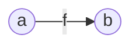
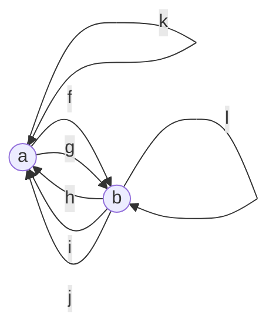
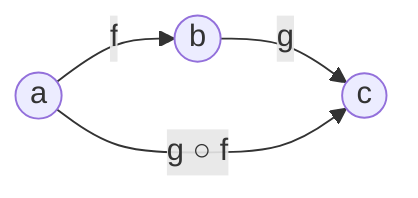
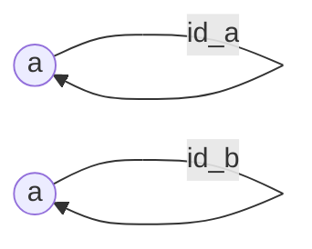
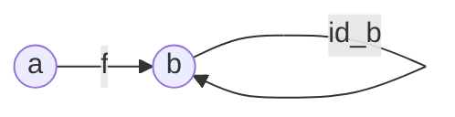
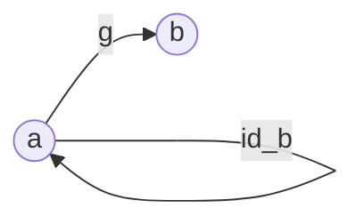
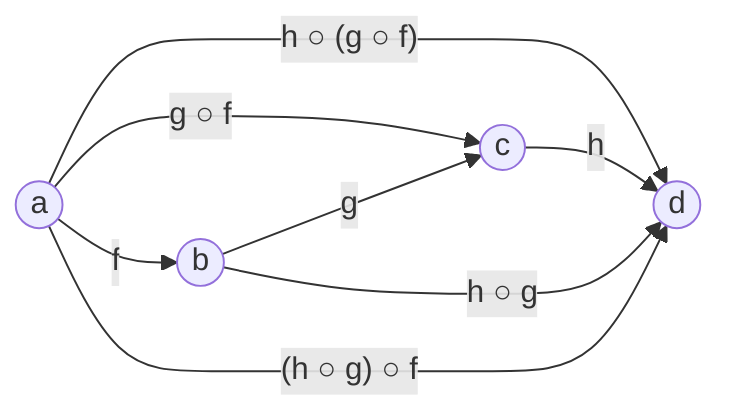
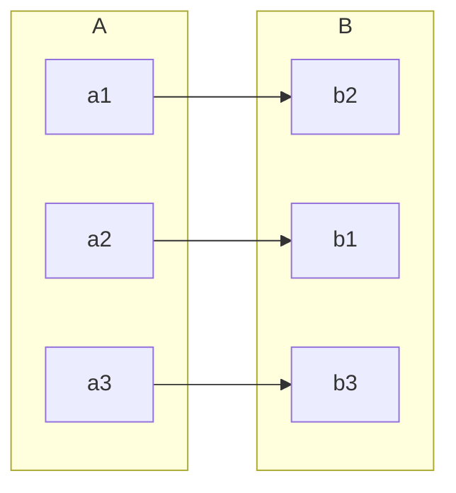
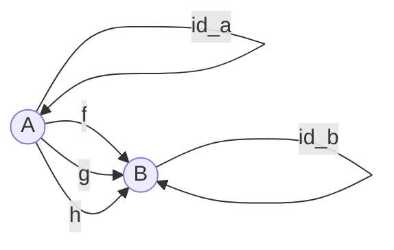

# Category Theory

The point of Category Theory is to unify mathematical theories (like algebra,
geometry, set theory, etc.) into terms that could be common among all the
mathematics. It can also be seen as a higher level of abstraction above
other mathematical constructs.

Category Theory can be brought down to:

- Composition
- Identity

A **Category** is a bunch of **objects**. It's not a **set** of objects though,
since a set is already quite a loaded term, with its own palette of rules. For
simplicity, it's then just easier to say that a category is a bunch of objects.

An **object** is a primitive - it has no properties nor structure. It's like an
atom, or a point, the lowest level of abstraction that we can go down to.

There might be **morphisms** between objects. Here's an example of a morphism
*f* between objects *a* and *b*:



A morphism is an arrow that has a beginning and an end. Between object *a* and
object *b*, there can be:

- 0 morphisms
- 1 morphism
- many morphisms

An arrow can point from *a* to *b* and from *b* to *a* at the same time. Or,
there could be arrow(s) starting and ending at the same object.



::: tip Objects
The only reasons why objects exists is to be able to mark the beginnings and
the ends of morphisms' arrows.
:::

So, a Category is a bunch of objects with morphisms between pairs of these
objects. A category could be seen as a kind of graph, loosely speaking - there
could be an inifinite number of arrows.

## Axioms

Composition and Identity are the fundamental rules of a category.

### Composition

If there's a morphism taking us from *a* to *b* and a morphism taking us from
*b* to *c*, then there has to be a morphism taking us from *a* to *c* defined
as: `g ○ f`. The `○` symbol mens that `g` is applied after `f` (`g ○ f` = `g`
after `f`).



The `g ○ f` arrow is a **composition** of arrows `f` and `g`.
It's sometimes called **multiplication**.

::: tip
There can also be other arrows going from `a` to `c`.
:::

::: tip
The whole category can be defined by a table of all compositions (not
morphisms?) within that category.
:::

### Identity

Every object in a category has its *identity morphism*:



#### Composition with Identity

Composition of any morphism with identity returns the original morphism:



```
id_b ○ f = f
```

That's the *right identity*.

We can also reverse the order of the morphisms morphisms:



```
g ○ id_b = g
```

That's the *left identity*.

::: tip
Identity is then like a `1` in multiplication: `a * 1 = a`.
:::

### Associativity



```sql
h ○ (g ○ f) = (h ○ g) ○ f

# Just like in multiplication:
a(bc) = (ab)c
```

## Example

An example of applying category theory could be the following. Let's imagine
that we have sets A and B:



There is a mapping between A and B, so there exists a function that transforms
elements from A to elements from B.

Category theory is supposed to unify various mathematical terms or theories
under one umbrella. Therefore, we can transform the sets into category
representation:



A set becomes an object. We have objects *A* and *B*. Between them, three
morphisms have been drawn, because the sets A and B had three functions between
them.

We can also see that there is an identity defined for each object. In sets, such
identity would be a function that takes a set, and returns the same set.

If there was another set - C - and there was a function defined between some
element of B and C, we could draw another object - C - with a morphism between B
and C. Possibly, we could also have a composition consisting of morphisms
between A and B, and B and C.

After creating the set category, we can forget about the origin of that data,
i.e. that it was a bunch of sets. Now we work on that category using category
theory. It's an abstraction making it possible to look at a set (a "low-level
thing") from a higher level of abstraction. It's kinda like moving from
assembler to some high-level language. Instead of a set consisting of some
elements, we have a table of morphisms that define our new category. They define
the interface of this category. The sets itself have been "shrunk" down to
points A and B.

::: tip Programming
In programming, we have types and functions. Types can be seen as sets, and
functions can be seen as functions mapping one set to another.
:::

## Functions

In maths, functions are defined as kind of relations. We have two sets:

- domain
- codomain

A function takes elements from a *domain* and maps it to some element from a
*codomain*.


## Constructs

### Monoid

A monoid is a combination of a set and an operation. In programming, a set is a
data type (like a `DateTime`). A **monoid** is a subset of a *semigroup*, it is
more strict than the latter. A monoid has the following requirements:

- operation must be *binary* - it acts on two inputs (e.g. addition, or a
  function `(Car, Car) => Car`)
- it must be *associative* - e.g., `(1 + 2) + 3 = 1 + (2 + 3)` - order of
  evaluation does not matter, the result is the same
- there's a *neutral element*, sometimes also called the *identity element* -
  it's a value that is neutral in a sense that it does not incur any change, it
  does nothing when an operation is applied to it. An example of an identity
  element in the addition operation is `0`, because `a + 0 = a`. For
  multiplication, the identity element is `1`, since `a * 1 = a`.

A monoid could also be described as a triplet consisiting of:

- a set
- an operation
- an identity element

The above triplet must satisfy the aforementioned rules.

#### Examples

- Addition on numbers, 0 is the identity
- Multiplication on numbers, 1 is the identity
- AND on boolean numbers, 1 is the identity
- OR on boolean numbers, 0 is the identity
- Concatenation on a collection, empty collection is the identity
