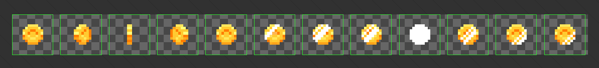
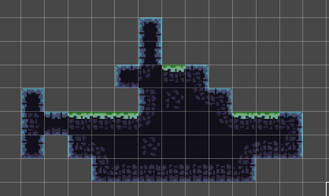

# {{ $frontmatter.title }}

To run Unity, you need to install Unity Hub, which is a manager of Unity
installations. Through the Unity Hub, install the lateset release of Unity, and
run.

::: tip Apple Silicon 
On Apple Silicon macs, for some reason, Intel binary is being downloaded by
default. You should manually select the Apple Silicon version instead.
:::

## Hierarchy

Game objects create a hierarchy. We can place items under other items. Then, the
positioning of the child items is relative to their parents.

## Scripting

Scripts can be added to the Assets, and they should be attached to some game
object to work.

### Editor Access

To modify script's (class's) fields in the Unity Editor UI, one of these should be applied:

- the field should be decorated with `SerializeField`
- the field shuld be `public`

The first approach is the recommended one, since a `public` field makes it
accessible to any other script as well.

::: tip Headers
If we have many `SerializeFields` fields, we can group them into categories with
`Header`:

```cs
[Header("Questions")]
[SerializeField] private TextMeshProUGUI _questionText;
[SerializeField] private QuestionSO _question;

[Header("Answers")]
[SerializeField] private GameObject[] _answerButtons;
[SerializeField] private Sprite _defaultAnswerSprite;
[SerializeField] private Sprite _correctAnswerSprite;
```
:::


### External Access

Each script is a class. We can access instances of these classes from other
scripts (classes) as follows:

```cs
FindObjectOfType<PlayerController>().DoSomething();
```

::: warning Service Locator
It's a bit like a Service Locator pattern, which I don't like. It's worth
investigating if Dependency Injection is used in the Unity ecosystem.
:::

The `FindObjectOfType` comes from the `MonoBehaviour` base class. It returns the
first found instance of `PlayerController` (I'm assuming that there is such a
script defined). We can also use `FindObjectsOfType<>()` if we expect there to
be many instances of some script.

The C# `public` keyword should be assigned to those components of our classes
that we want to be accessible from the outside, by other scripts.

::: tip
The `FindObjectOfType<>()` method may also be used to find components
placed on other game objects.
:::

::: danger Awake()
The `FindObjectOfType` should not be used in `Start`, but rather in the `Awake`
lifecycle method. Otherwise we might encounter some `NullReferenceException`s
being thrown.
:::

### Scriptable Objects

Other than a normal Script, there is also a **Scriptable Object**. This kind of
script is optimized for low memory footprint, it is useful for storing data.
They are not attachable to game objects.

Examples of usage:

- statistics of objects in RPG game
- all cards in card game
- questions/answers in a quiz game.

We create a Scriptable Object the same way as a typical Script (*Create* -> *C#
Script*).

Here's code example:

```cs
[CreateAssetMenu(menuName = "Quiz Question", fileName = "New Question")]
public class QuestionSO : ScriptableObject
{
    [TextArea(2, 6)] //displays a bigger text area in the Unity editor
    [SerializeField]
    private string _question = "Enter new question text here";
    public string Question => _question; // public getter

    [SerializeField]
    private string[] _answers = new string[4];

    [SerializeField] 
    private int _correctAnswerIndex;
    public int CorrectAnswerIndex => _correctAnswerIndex; // public getter

    public string GetAnswer(int index) => _answers[index]; // public method
}
```

The `[CreateAssetMenu]` attribute makes our Scriptable Object available in the
context menu of Unity's *Create*:


::: tip Customization
We can customize the text of the extry in the context menu and the name of the
file being created when it's clicked with:

```cs
[CreateAssetMenu(menuName = "Quiz Question", fileName = "New Question")]
```
:::

When we create an "object" based on our Scriptable Object, Unity's Editor will
display the fields that we've configured:

  

## Collisions

If we want to collide with some object, both objects should have a **Collider**.
Additionally, to make the objects move on collision, they need to have
**Rigidbody**. Rigidbody is what adds physics to the objects. One of its
properties is **Gravity**. In 2D top-down games, Gravity should be brought down
to 0, otherwise the Rigidbody will cause the game object to fall down.

::: tip Physics Sprite
Instead of creating a Sprite, attaching a Collider and Rigidbody, we can create
a Physics Dynamic Sprite, which out-of-the box is a Circle with a Collider and
Rigidbody.
:::

::: warning Falling Through
The default Rigidbody's Collision Detection is **Discrete**. It's better for
performance, but it might cause the collision detection to fail sometimes
(when?). A fix for that is to change the detection to **Continuous**.
:::

### Layers

Game objects may be placed on different layers (different than Sorting Layers).
Then, we can define how objects from different layers collide with each other
(or not) in the Project Settings (2D Physics section):


In this cases, all layers collide with all the other layers.

With layering we could have a setup where a player is able to go through some
objects (of some specific layer), while enemies (being on a different layer that
the player) will not be able to go through these objects.

::: tip
Layers can also be used for other things, like excluding some objects from being displayed by the camera.
:::

### Collision Trigger

Sometimes we don't need physics to be involved in a collision. All we might want
is to know that some object touched another. An example of that is a player
reaching the finish line


For such cases, a Collider has the **isTrigger** property. A proper script
behind object with such a collider will fire anytime another collider touches
this collider.

```cs
public class FinishLine : MonoBehaviour
{
    private void OnTriggerEnter2D(Collider2D other)
    {
        Debug.Log("Finish Line reached!");
    }
}
```

::: warning Physical Collision
When **isTrigger** is selected, the Collider no longer works as "collision
barrier", meaning that objects will not physically hit each other. Instead, the
objects will just pass through each other.

An alternative approach is to leave the **isTrigger** unchecked and to use the
**OnCollisionEnter2D** method instead of the **OnTriggerEnter2D** one.
:::

## Timing

The spped of movement of objects should not rely on FPS of the host machine. We
should multiply the object's translation by the `Time.deltaTime`, which is the
time frame. This way, the intended translation will be properly divided for each
frame giving us the desired translation after each second.

## Units

Unity does not have any particuar unit system. While designing our games, we
should come up with our own way understanding these units. One way is to treat 1
Unity unit as 1 meter. This way, the grid on the screen divides the world in 1m
x 1m squares. We can scale game objects with regard to that system. The same
way, we can calculate speed of objects, to make things look and behave
"naturally".

## Sprite Shape

**Sprite Shape** is perfect for creating ground in 2D platformer games. It allows us
to modify the shape of the land easily with vector graphics tools. We should add
an **Edge Collider** to it, and it will automatically follow the Sprite Shape's
shape. Sometimes it's necessary to adjust the offset of the Shape Controller to
have the collision exactly where we want it to be.


## Camera Follow

To have the Camera following the player, we can do one of:

- script the camera position to be updated in every frame to player's position

    ```cs
    transform.position = _thingToFollow.transform.position + new Vector3(0, 0, -10);
    // we're adding -10 on Z axis to keep the camera away from the game world
    ```

- use **Cinemachine** - a package for camera management

## Tagging

Tagging is a useful concept in Unity that allows us to add a simple string
metadata to our game objects. Multiple objects might reuse the same tag. In our
scripts, we can read tags of other objects to create some conditions. For
example, a Finish Line should only activate its script when Player reaches it.
Other objects passing through it might not necessarily need to invoke any
actions. The way to do it would be to check the tag of the `other` object.

```cs
public class FinishLine : MonoBehaviour
{
    private void OnTriggerEnter2D(Collider2D other)
    {
        if (other.tag != "Player") return;
        
        Debug.Log("Finish Line reached!");
    }
}
```

::: tip Hierarchy
If a top-level object in some hierarchy has a tag, but some other, lower-level
object has a Collider, the tag will still be readable.
:::

## Delay

There are two ways to delay some action in Unity:

- `Invoke()` - works like `setTimeout` in JS. Weirdly, instead of accepting a
  delegate, it accepts a name of the method to be invoked, as string. That means
  that it used reflection under the hood, which is not perfect.
- Coroutines

(What about async?)

## Particles

Unity suppors Particle System. Any game object might have Particle System
component added. Another way is to add a game object for the particles and to
attach the particles to some other object.

Particles are very configurable, we can set all the looks of it as we'd like. An
interesting setting is the **Simulation Space**. By default it's set to "Local",
which means that the particles will always be positioned relatively to the
object they're attached to. An alternative is the "World" setting, which makes
the particles position relative to the game world, making some effects more
valid. If player bleeds, we don't want to blood drips to move with the player,
but rather to stay where they were released.

Another important settings are:

- Looping
- Play On Awake

## Tiles

When creating 2D games, especially pixelart ones, it makes sense to use square
tiles to build the game world. It could be some platformed or top-down game.

The process is usually as follows:

1. Create/Get some assets with these tiles. Usually the tiles belonging to one
    "theme" are packaged all together in one file. Here's an example:
    
    

2. Add this file (or files) to the project.
3. Adjust the *Pixels Per Unit** setting so that the size of the inidividual
   tiles is correct (whatever is comfortable, e.g., tile's width equal to Unity
   unit).
4. Select the file, change its **Sprite Mode** to **Multiple**.
5. Open the Sprite Editor and split the file so that each tile has its own box.
   Click **Apply** and close the editor.

    ::: tip
    Usually, the tiles should have the same size.
    :::

6. Add a TileMap game object to the Scene. It will also create a Grid game
   object. If there will be multiple Tilemaps (different layers of the scene),
   put them all under a single Grid.
7. Open the Tile Palette and create a new palette.
8. Drag the split tiles into the palette, save the assets somewhere (like the
   `Assets/Tiles` directory).

At this point, we can start placing the tiles into our Tilemap. When there are
multiple Tilemaps, make sure that the right one is selected before you start to
place the tiles.

::: tip Erasing
There is an Eraser tool in the palette. If we want to erase more than one
element at a tile, we can draw a bigger rectangle in the palette in some empty
space. That empty rectangle will be "copied" and we will be able to place it
anywhere in our world, removing all tiles underneath.
:::

### Rule Tile

Placing tiles one by one is quite tedious, especially when building bigger
levels. It might make sense to create a **Rule Tile**. Rule tile is a
combination of multiple tiles, where each of them has rules defined regarding
its placement. Here's an example of a rule:


For the specified tile, there shouldn't be any other tile placed where the red
"X"s are placed. On the other hand, this kind of tile requires some other tiles
to be placed on the opposite corned (greed arrows). Additionally, we this tile
can be mirrored in the X axis - the grey array signifies that.

We also have the option to specify the same rules for multiple tiles, making the
choice random for Unity.

The order of the rules is meaningful. The first rule that satisfies the given
placement will be selected.

With the Rule Tile defined, creating the world is greatly simplified, we just
have to paint a single Rule Tile all over the place, and the proper sprites will
be painted in its place. Here's an example:



It seems that a separate Rule Tile should be created for separate "themes" of
our tiles. For example, the tiles for the forest would be different than the
tiles for dungeons. The rules would probably be similar, but the sprites would
be different.

(Don't the assets from Unity Asset Store come with the Rule tile predefined? I
guess it would make sense)

## Prefabs

If we want to reuse some game object many times in our game, it makes sense to
turn it into a **Prefab**. Prefab is a template that can be instantiated as many
times as we want. So, for example, we could have Player game objects with
configured graphics, animations, sounds, etc. We could turn it into a prefab to
easily instantiate it in different levels. We could probably say that the
default game objects that we can create in Unity (like the Circle Sprite) is a
kind of a prefab.

To turn some game object into a prefab, we need to drag that object from the
Hierarchy panel down to the Project explorer. A new file with a `.prefab`
extension will be created.

When we make changes to the prefab, all instances will be updated as well. We
can still apply some individual changes to a single instance of a prefab
("override") as well though.

Prefab instances have a blue-ish color in the Hierarchy panel.

## Input System

Unity has two ways of controlling the game:

- the *old way* with `UnityEngine.Input` APIs - simpler
- the *new way* with the *Input System* package that has to be installed into a
  project. It is more convoluted to set up, but it is more "declarative". There
  is a panel where we can configure all possible actions in the game and bind it
  to various sources (keyboards, gamepads, etc.). 
  
  
  
  There are many ways to invoke
  our scripts on input - via special methods, events, and others.

::: warning
You can't use both systems at the same time. When the "new" Input System gets
installed, the older APIs get disabled.
:::