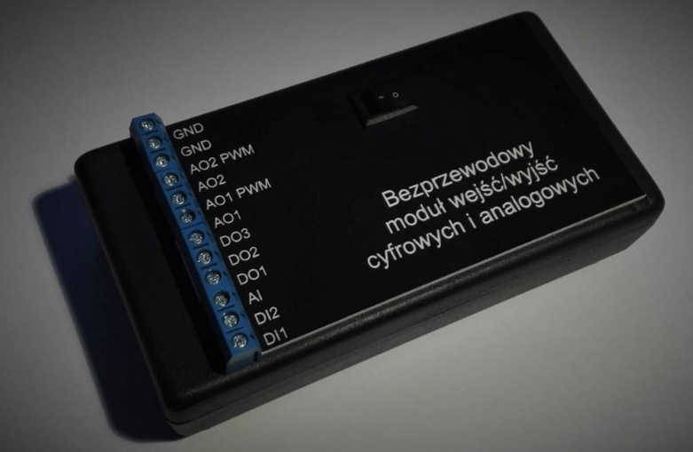

# Wireless analog/digital I/O module for mobile devices

My BSc studies have been concluded with a thesis titled "Wireless analog/digital
I/O module for mobile devices".

## Abstract

This thesis concentrates on presenting the implementation and the final effect
of building of wireless module, whose functionality is to measure and generate
voltage signals. In order to work, the presented device requires an external
unit like smartphone, tablet or PC. Using the included application, user can
observe the states of digital/analog inputs and set the states of digital/analog
outputs. In the second case, the user can generate constant or sinusoidal
voltages.

The device has been constructed with the usage of a microcontroller – AVR
ATMega328P. It is equipped with the required inputs/outputs. It also has, used
in this project, PWM outputs, timers, analog-digital converter, UART
communication support and others. The collected data is sent using the Bluetooth
interface, which required an installation of an external module – HC-05. In
order to speed up the rate of communication between microcontroller and
Bluetooth module, both have been set to transfer data at the rate of 115200 bits
per second. 

In order to control the device, a dedicated Windows 10 application has been
designed and developed. It has been written with Universal Windows Platform
(UWP) usage, which is based on the .NET technology. The program is created with
asynchronous operation in mind, which relies on: Timer class, async functions,
Task class. User Interface has been designed with simplicity as one of the the
main priorities. Main application view consists of four tabs: digital inputs,
analog input, digital outputs, analog outputs. The user can freely switch
between those and control the wirelessly connected device with the use of
implemented virtual switches and sliders.

The final device is built on the universal soldering board and it is powered
from a 9V battery. The performance of the system fully covers the proposed
goals, both read and set voltages are correct.

