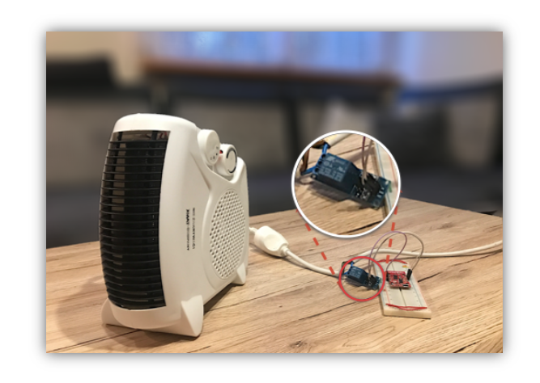
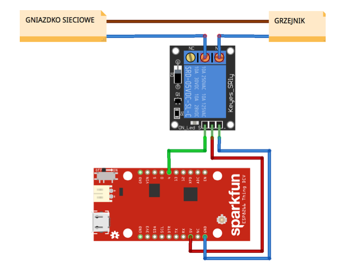
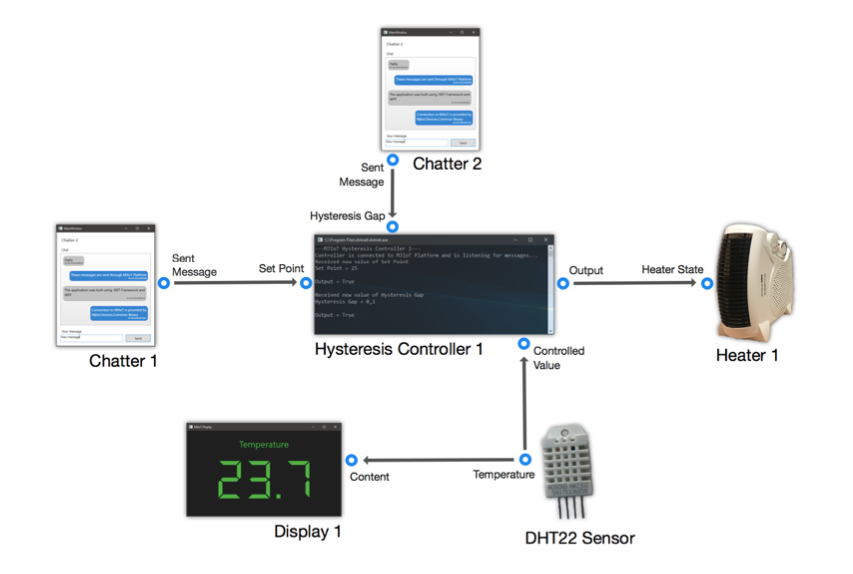

# MJ IoT

MJ IoT was a result of my work on the thesis titled "Design and implementation of
Internet of Things System based on cloud computing model". It is an IoT system
built on Azure, consisting of a few applications that work together to deliver a
platform for devices to connect with.

## Technologies

- .NET Framework
- .NET Core
- AVR C/C++
- Microsoft Azure Platform
    - Azure SQL
    - Cosmos DB
    - Azure Functions

## Abstract

The thesis presents practical implementation of Internet of Things system that
emphasizes the possibility of connecting many devices together. Another useful
feature is the ability to collect telemetric data from connected “things”. This
project makes use of cloud services, that are subject of most of the thesis.

The most important part of the designed platform exists in the cloud. The chosen
cloud provider is Microsoft with its Azure subscription offering. Transport of
data in the system is achieved by the means of IoT Hub service. Users’ data are
stored in two database systems: Azure SQL and CosmosDB. The platform’s logic is
hosted in a serverless architecture, delivered by Azure Functions.

Another crucial part of the thesis is modelling approach. Every “thing” that is
connected with the platform has a corresponding model, which defines its
properties set. Each of these properties is characterized, among others, by its
data type that it can store. The user has the ability to define new models based
on the ones that already exist. This feature is available through the usage of
inheritance.

Connecting devices is done by associating together properties of these devices.
Any property of a given device (such as state of a light bulb) can be used as an
output or as an input. The simplest example would be a pair of a button and a
light bulb. A button could have a property called "pressed". It can be either
true or false. That propertyl may be connected to the light bulb's "powered"
property. As a result we would get a button-controller light.

User has an option to set filters and calculations. Filters provide
functionality to block communication in defined situations, while calculations
enable the possibility of modifying messages before they are delivered to the
recipient device. One of the available calculations is custom C# scripts. The
user is able to create a program that can modify communication data in any way.

The user has access to the platform by the use of web application based on the
Angular framework. Features of this application include: viewing a list of
user’s devices with its details; defining and deleting connections; displaying
telemetry data in a form of a chart or a list, with corresponding timestamps.

## Control Panel

An essential part of the project was a web application allowing users to manage
their devices. The app was created in Agular.

## Devices

Here are a few examples of the devices that I've built for the needs of the
project. Some of them are a mixture of hardware and software, while some others
were purely software-based.

### Heater

I've purchased a generic heater and modified it by including a controlled relay
in its electrical circuit.

### Temperature and Humidity sensor

One of my sensors was a simple temperature and humidity sensor that I've connected with a microcontroller.

### Display

A purely software-based device - a display. It could be connected to other
devices to display their outputs (e.g. when connected to the temperature output
of the temperature and humidity sensor we could observe the temperature).

### Hysteresis Controller

Another software-based device was a hysteresis controller that allows for an
automated control of other appliances based on configuration parameters.

### Chat App

One of the most interesting "devices" that I designed was the chat application.
Its input was an incoming message. The output was an outgoing message.

## Applications

As part of my work, I have also prepared a few practical use-cases of the MJ IoT
Platform.

### Temperature Control

Connecting a few of my devices together and using the capabilities of MJIoT
Platform I was able to have a working room temperature control system. This
system uses some basic automation principles like the feedback loop.

Here's how I've connected various devices together to get a working system:

The Heater was obviously responsible to heat the room. Depending on the input
from the Hysteresis Control, it was either ON or OFF. In order to change the
temperature settings I used two instances of the Chat App. In order to configure
Set Point (desired temperature) and Hysteresis Gap (a characteristic of any
hysteresis controller) I'd just send a message to the controller. The controller
wouldn't be able to work properly without a feedback signal. Such a signal came
from the Temperature Sensor that I've connected to the Controller. Additionally,
to have live temperature information I've added the Display. It was connected to
the output of the Temperature Sensor.

All of the connections were configured via the MJ IoT Control Panel as follows:

With all that, I achieved typical temperature control characteristics with a
hysteresis controller:

The blue color represents the controller output (commands for the heater to be
on or off); the yellow color represents the desired temperature; the green color
represents the actual room temperature. You can see that it has a sinusoidal
shape, which is typical for the type of a controller that I've designed.

### World-wide Chat Service

A really fun application of MJIoT was to use it as a chat platform. I have
connected two instances of my Chat app together (output of one goes as
an input to another) and got a simple chat system.

The image shows an example of how I've been testing the solution. The PC on the
left was in Poland (me), while the one on the right was in Tunisia (my
friend's). We were able to communicate similarly to other popular solutions such
as Facebook Messenger.

## Links

The thesis was written in the Polish language. It's available here:
[GitHub](https://github.com/marcinjahn/MJIoT-Master-Thesis).

All of the code is open-source and can be found on [my
GitHub](https://github.com/marcinjahn) (all microservices and apps are under
different repos with the name including "MjIoT").