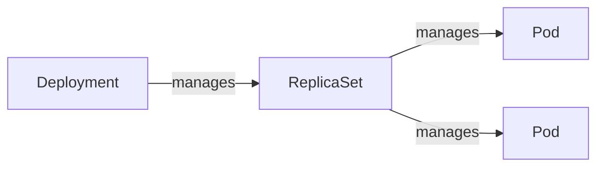

# Scaling

It's not very convenient to manage pods individually. We need ways to deploy
pods in multiple replicas, which is a base for high availability of the service.
Additionally, we need a way to keep pods running in case some node fails.

## ReplicaSet

ReplicaSet allows us to create a group of pod replicas, instead of just one pod.
The pods managed by the ReplicaSet are selected using an immutable label
selector (similarly to [Services](./services.md)). There is also a template,
which defines the pod(s) that will be created under ReplicaSet. Such a pod has
to conform to the *selector* specified by the ReplicaSet. 

::: tip Existing Pods
If some pods matching the selector already existed prior to the creation of the
ReplicaSet, they're counted as part of the ReplicaSet.

If we manually create some pod(s) that conform to ReplicaSet's selector, the
controller will delete some pods to reach the *replicas* count.
:::

Pod names are generated based on the ReplicaSet's name, but it can be changed
with the `generateName` setting.

::: tip ReplicationController
In the past, ReplicationController was used instead of ReplicaSet. It behaved
the same as ReplicaSet does. It is now deprecated.
:::

ReplicaSets are rarely used directly due to their lacking pods updates
possibilities.

### Updates

We're free to change `replicas` count and the number of pods will reflect the
setting.

If we modify the `template` of some existing ReplicaSet, the existing pods will
not be updated. Instead, just the pods created by ReplicaSet in the future will
have the new settings applied.

### Replacing a Pod

Sometimes we might want to investigate some issue in one of the pods, while
keeping ReplicaSet running with proper scaling. We could temporarily increment
the *replicas* config, but we'd have to rememeber to decrement it back later on.
Instead, we can just change the labels of the faulty pod so that it does not
conform to ReplicaSet's selector. The ReplicaSet's controller will create a new
pod for its needs while we can start investigating the faulty pod.

### Ownership
Pods managed by a ReplicaSet have a special "ownerReference" section in
their "metadata". A pod can have multiple owners.

Pods are auto-deleted when the owners are deleted (unless the `--cascade=orphan`
parameter is applied while removing the owner).

If a pod is taken out of the ReplicaSet (like [this](#replacing-a-pod)) the
"ownerReference" metadata is deleted from it automatically.

## Deployment

Deployments manage Pods via a ReplicaSet. They are mostly used for stateless
workloads.



::: tip ReplicaSet Updates
If we try to edit ReplicaSet managed by a Deployment, our updates will be
replaced with Deployment's config soon after. ReplicaSet is controlled by the
Deployment and we should modify its settings throught the Deployment.
:::

In addition to settings available to ReplicaSets, Deployments also contain the
`strategy` configuration. It dictates how Pods are replaced during updates.

::: tip Existing Pods
If some pods already exist that match the Deployment's selector, most likely
they will not be reused in the Deployment's replicas. The ReplicaSet managed by
the Deployment adds additional ("random") label requirement to the pods it
manages.


:::

### Updates

Compared to ReplicaSets, updating Pod template causes all the existing Pods to
be redeployed to meet the new requirements. Anytime we update Pod's template a
hash of it is calculated, and a new ReplicaSet is created with that hash being
used for one of the selectors.

### Example

Creating a simple deployment: `kubectl create deployment kiada
--image=luksa/kiada:0.1`

Kubectl sends a POST request to `/deployments` of K8s API to create a
*Deployment* object. Kubernetes creates a *Pod* object based on Deployment. The
pod is assigned to a Worker Node. Kubelet on a worker node pulls the image and
runs the container.

We can track a deployment with `k rollout status deployment my-deployment`.

### Scaling

`kubectl scale deployment kiada --replicas=3`

## Pods Deletion

When scaling down, K8s selects pods to delete based on some priorities:

- pods that are not started
- pods collocated on the same node with greater number of replicas
- pods that lived shorter
- pods with a greater number of restarts

We can also influence the priority by applying `pod-deletion-cost` annotation to
specific pods.

## Logs

There is no easy way to display logs from all the pods in a ReplicaSet/Deployment.
Instead, we have to use label selector:

```sh
k logs -l app=myapp --prefix --all-containers
```

- `--prefix` prefixes each log with the container that it came from
- `--all-containers` displays logs from all containers of the pods