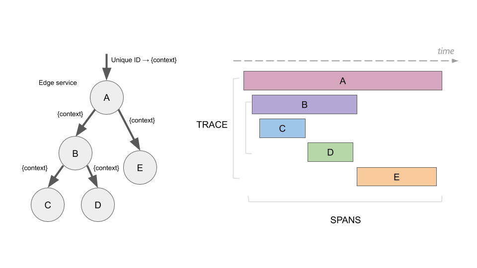
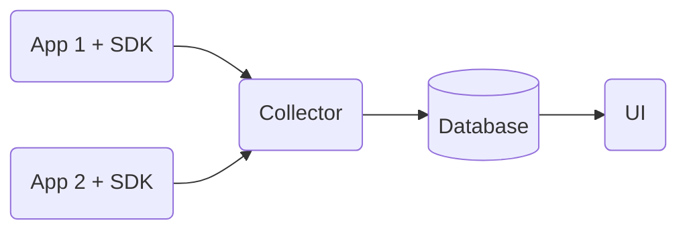
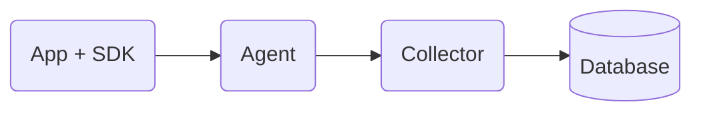
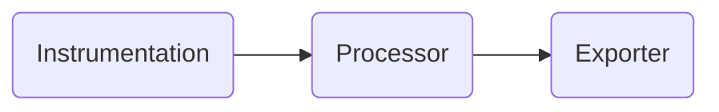
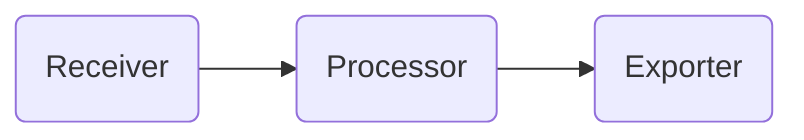

# Tracing

Tracing is one of the pillards of **Observability**. It is analogous to stack
trace of a program, but in the distributed world of (micro)services.

First, it started as seperate efforts of various entites, nowadays it is
standardized under the [Open Telemetry](https://opentelemetry.io/) initiative (a
part of [CNCF](https://www.cncf.io/)).

A **trace** is a collection of **spans** - time-bound operations that are part
of some scenario. Most often these are network calls, but they can also
represent other things. We could  actually represent a "traditional" call stack
of a single process with spans of a trace. Although possible, it's not the
recommended approach. It is alright though to include the most important parts
of a single process (especially the ones that take majority of time of a trace)
in a trace.

Here's an illustration that represents tracing, found in the [Jaeger
Docs](https://www.jaegertracing.io/docs/1.41/architecture/)

## Architecture

Most often, the general tracing setup looks like this:

The *SDK* and *Collector* are a part of OpenTelemetry. The UI needs to be
something that conforms to the OpenTelemetry standard, e.g.
[Jaeger](https://www.jaegertracing.io). The choice of teh database is dictated
by both the Collector and UI, since both theses entities will access the
database.

The architecture could differ, some new actors could be added (like agents), or
removed (e.g., Jaeger could be run with in-memory database).

Here's how it could look like with Agent added:

The purpose of having an Agent is to relax the burden of network communication
between the App and the Collector. The communication with the Collector could be
slow. The communication between the App and the Agent should be fast (Agent
could be a side-car of our App).

Other than that, the Agent is actually the same app as Collector. It has a bunch
of configuration that could be useful for us (explained down below).

### SDK

Looking at a single app, the SDK works in a pipeline, like this:

#### Instrumentation

Instrumentation is the origin of every span. We can create spans manually, or
automatically via auto-instrumentation. Auto-instrumentation is specific to
various protocols/frameworks. E.g., we could install auto-instrumentation for
Express or Nest.js, and it will automatically create spans for every incoming
request. Many frameworks have some accompanying auto-instrumentation (often
various versions for the same framework).

Spans may have some additional metadata attached. These are **Resources**. We
can add some data to every span, enriching them. Examples include:

- git commit ID of the running process
- container ID of the running process

There are also additional apckages called **Detectors**. They are able to
automatically attach some environment-specific data to our Resources. Examples
could include Azure Detector or AWS Detector. These would automatically include
some cloud-specific data to our spans. Similarly, git Detector would attach
commit ID (if `.git` directory is part of the deployment). A detector could also
discover the name of our service (e.g., based on `package.json`).

All the setup of tracing is wrapped in a provied - e.g. `NodeProvider` for
Node.js apps.

##### Custom Intrumentation

The SDK allows us to implement custom intrumentations. That may come useful when
some framework or library does not have any available instrumentations.
Auto-intrumentation helps in keeping the code clean of tracing logic. Manual
instrumentation on the other hand, "pollutes" the code with non-business logic.

::: tip
Sometimes, manual instrumentation is the right choice! It's only the cases that
are non-seldom and well-defined that benefit the most from auto-instrumentation.

It's often best to start with manual instrumentation and create
auto-instrumentation based on it later on.
:::

#### Processors

Processors sit between the instrumentation and exporters. Most often, they are
used for batching. Out-of-the-box, the following processors are available:

- SimpleProcessor - just relays every single span to the Exporter
- BatchProcessor - batches spans and relays these batches to the Exporter
- NoOpProcessor - drops every span, nothing will be sent
- MultipleProcessor - allows to compose multiple processors in a single pipeline

#### Propagation

In some cases, it is difficult to attach tracing metadata in the messaging with
other services. WebSockets could be an example of such messaging. WebSockets do
not support any way of sending metadata, like headers in HTTP. Because of that,
data like `traceId` needs to be sent as part of application message. The SDK
comes with a propagator that can both inject and extract that metadata from the
messages. Both the sender and the receiver need to be aware of this metadata
being there.

Another example could be Redis - it also does not support metadata.

##### Formats

There are a bunch of formats of tracing that have emerged since tracing was
born. The one used by default by the OpenTelemetry SDK is the [W3C Trace
Context](https://www.w3.org/TR/trace-context/). In short, it includes tracing
information (like trace ID) in an HTTP header called `traceparent`.

There are also other standards, like Jaeger and B3. These are considered legacy,
and shouldn't be used by new projects. However, there are cases where we want to
integrate with older systems that still use the proprietary format. The
OpenTelemetry SDK supports us with that via propagators. By default, the W3C propagator is used. A propagator basically does two things:

- **extracts** tracing metadata from the incoming communication (like an HTTP request)
- **injects** tracing metadata into the messages going out

A propagator really needs to implement just these 2 methods, and it can be used in tracing initialization.

::: tip
It might happen that only one side of propagation is needed, e.g. extraction. We
might be integrating with some system that sends us tracing headers in Jaeger
fomat, but we might not want to propagate tracing in that format further on,
since W3C is the format we want to use.

OpenTelemetry does not have any APIs to enable/disable specific side of
propagation. Instead, we'd need to implement some kind of "wrapper" that blocks
the functionality we don't need.

More on that
[here](https://github.com/open-telemetry/opentelemetry-specification/issues/3153).
:::

## Traces

Traces are composed of spans. Spans are composed of:

- timestamps (start and end)
- origin service
- events - things that happened during the span, but do not deserve their own
  separate span. Potentially, that could be due to the fact that they do not
  have start-end timestamps.
- attributes - key-value pairs of meta-data (similar to Resources, but we can
  attach them ad-hoc, isntead of predefining for all spans)
- errors - if an exception occurs during the span, the error message could be added.
- traceId - each span belongs to some trace.

An important concept is how traceId is being shared among services. There always
is some root service where the journey starts. That service generates the
traceId. Any call to other services will include that traceId. This way, when
these downstream services record their spans, they will attach the traceId that
they received.

Traces are being sent by all the services to the collector (could be via Agents,
but it doens't matter in this context). Interestingly, a root service (or any
other service in the chain) may decide not to trace (e.g. due to sampling
configuration). That decision may be transmitted to the "child" services. If
these services are properly configured, they will respect the upstream decision,
and will not trace the traffic. 

## Collector

The collector works very similarly to the SDK in an app. It has a pipeline:

There could be many receivers, processors, and exporters. Instead of
initializing the pipeline in code (like we do with the SDK), we do it in YAML.

Processors include things like Sampling.

### Sampling

One of the most important things to configure in a Collector is **Sampling**. In
bigger systems, the amount of traces that we collect could have significant
impact on the costs and performance.

In general, the following samping strategies should be applied:

- **100%** sampling - when we don't have a lot of traffic in the systems, it might
  be alright to just log everything
- **20-50%** - debugging issues - this amount of traces should be enough to debug
  some system-wide issue
- **5-10%** - typical setup - it should be enough for general monitoring of the
  system. If something fails, we'll record 10% of failures
- **5%** - understanding the system architecture

The sampling may be configured with more details, like logging 10% of traces
uncless there's an error - then, we'd always log it.

Sampling can be done on two levels:

- app (SDK) - **head-sampling** - apps decide what to send
- collector - **tail-sampling** - apps send everything

Some mix of the two could also be utilized.

The difference between the two is about the point in time when the decision to
sample is being made. 

#### Head-Sampling

In head-sampling, when the root service decides not to trace some request, it
will ask downstream services not to trace as well. If, during that journey, some
error occurs, trafific will not be traced (unlesss some child service is
configured otherwise, but it will not help us with missing spans from the parent
that did not want to trace).

Service that makes the sampling decision makes it *before* a potential issue
occurs. It's non-ideal.

::: tip 0%
In tail-sampling, even with 0% sampling configured, services will still transfer
tracing header between each other - that's needed for downstream services
to know that they should not send traces to the collector!
:::

### Tail-Sampling

In tail-sampling, the collector has access to the whole trace and may decide
whether it wants to store it or not. The decision can be made based on various
factors:

- span(s) latency
- some attribute values (e.g. HTTP status codes)
- span(s) status codes (since traces can have errors attached)
- rate limiting (e.g. max 50/s)
- probabilistic (e.g. 50%)

::: tip Decision time
Spans arrive at the collector asynchronously. The collector cannot really tell
if at some point in time all the spans composing a given trace were already
collected. This is why one of the parameters affecting sampling is *decision
time*. This is the timespan that the collector should allow for incoming spans
to come in (starting from the first one that came in) until the sampling
decision is made.
Before making the decision to sample, spans are stored in-memory.
:::

::: warning Load Balancing
In bigger systems, with multiple collector replicas, it's important to configure
trace affinity, so that one collector wil receive all the spans belonging to a
single trace. That way, sampling decisions may be better informed.
:::

---

Head vs tail sampling:

- when we only want to log errors - Tail
- when we want to log only traces with latency problems - Tail
- when we want to log only specific routes - Head

## Tips

- In Node.js, tracing needs to be enabled before even importing any other
  non-tracing related dependencies!