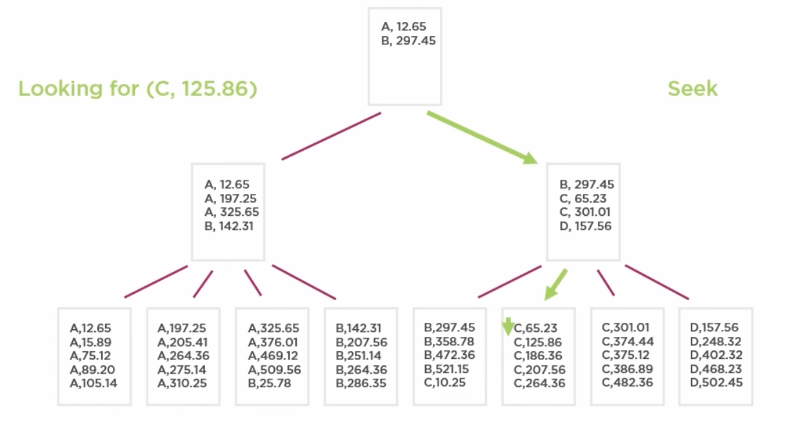
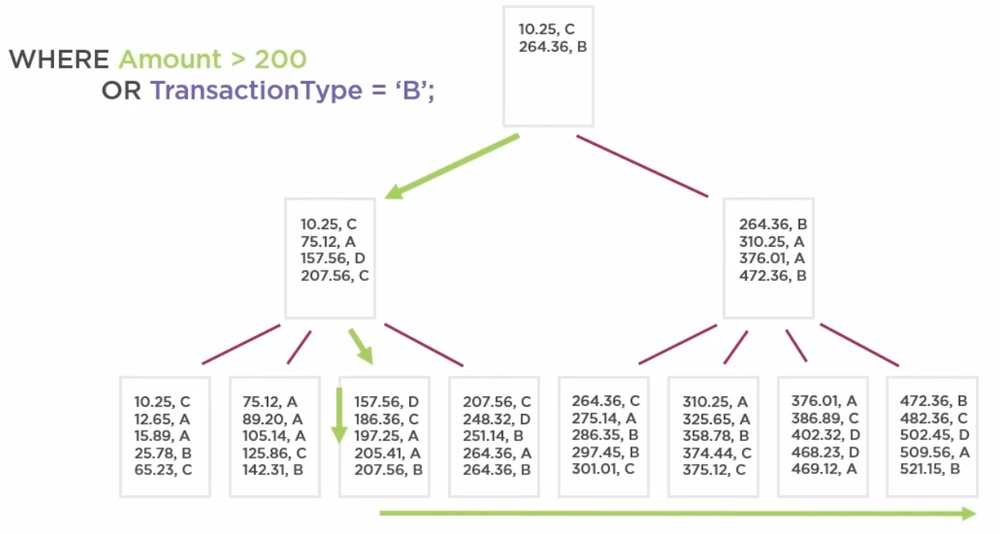

# SQL Server Overview

## Running in a Container

On AMD64 PCs just use the sql-server docker image.

On M1 macs, use the following:

```sh
docker run --cap-add SYS_PTRACE -e 'ACCEPT_EULA=1' -e 'MSSQL_SA_PASSWORD=Qwerty1!' -p 1433:1433 --name azuresqledge -d mcr.microsoft.com/azure-sql-edge
```

It's the SQL Server Edge - at this moment it's the only SQL Server variant
compiled for ARM64.

::: tip Password
Password needs to be min 8 chars long, 1 capital letter, 1 digit, 1 symbol.
:::

## Structure

- RDMS:
    - Databases
        - Schemas (the default is *dbo*) - they act as namespaces, they are
          useful for managing security
            - Tables
                - Columns
            - Views
            - Stored Procedures

Every object in the database has its fully qualified name in the format:
`{Instace}.{Database}.{Schema}.{Object}`.

::: tip Instance
The `{Instance}` part comes from the fact that a single OS can host multiple
instances of SQL Server.
:::

## Naming

Popular Choices:

- PascalCase
- underscore_separated
- Hybrid_Of_Above

## Best Practices

### Normal Forms

Normalization defines a set of rules that help to achieve a good design of a
database, reducing duplication and data anomalies.

1. 1NF
    - one value per table cell (e.g. first and last names)
    - rows should be unique - primary key should be there
2. 2NF
    - single-column primary keys
3. 3NF
    - Column values should only depend upon the key - if any non-key column
      depends on column(s) other than the key one, this data does not belong in
      that table. For example, keeping patient's doctor phone in the Patients
      database is not a good idea. There should be a separate table - Doctors -
      and patients should be linked ot appropriate doctors.

There also other Normal Forms.

## Constraints

Constraints specify additional rules for the columns in our tables.

::: warning Overwriting
We can't just overwrite existing constraint. First, we need to remove existing
constraint, and then we can create a new one.
:::

### NULL

We can "constraint" columns to allow NULLs. By default, the `NOT NULL` constains
is applied.

### DEFAULT

Provides a default value for a column. It is useful when `NOT NULL` is applied
as well.

### Primary Keys

Thy ensure uniqueness. It provides a backing index. That index can be
**clustered** or **unclustered**.

### UNIQUE

It ensures no duplicates of some column. It allows NULL (but only one!). They
are backed by an index (clustered or unclustered (the default)).

The `UNIQUE` constraint can be applied on multiple columns, meaning that the
combination of their values should be unique.

### Foreign Keys

The Foreign Key constraint links two tables together. We cannot create an entry
that refers to a non-existing entity. For example, we can't create an
`OrderItem` for an `Order` that doesn't exist.

```log
The INSERT statement conflicted with the FOREIGN KEY constraint 
"FK_OrderItems_OrderID_Orders_OrderID". The conflict occurred in 
database "BobsShoes", table "Orders.Orders", column 'OrderID'.
```

::: tip Index
There is no automatic backing index created for foreign keys. It is recommended
to create it though.
:::

#### CASCADE

Entities referred to by a foreign key cannot be deleted. We can help ourselves
with the `CASCADE` option. Whenever we delete an entity referenced by a foreign
key, the entity that refers to it will be deleted as well.

```sql{6}
CREATE TABLE Orders.OrderItems(
    ....
    StockID int NOT NULL
        CONSTAINT FK_OrderItems_StockID
            FOREIGN KEY REFERENCES Orders.Stock (StockID)
                ON DELETE CASCADE
)
```

::: tip SET NULL
We could also use the `SET NULL` option instead of `CASCADE`. That would set the
value of a foreign key to NULL, instead of deleting the whole row.
:::

### CHECK

This constraint allows to define declarative various conditions on the
table-level or on the column-level. The conditions are boolean expressions.

::: tip SELECT
Conditions cannot contain `SELECT`. However, we can call a function that
executes `SELECT`.
:::

Examples:

- `CHECK (LastName <> '')` - `LastName` value can't be empty
- `CHECK (StockName <> StockDescription)` - two columns can't have the same
  values
- `CHECK (Currency IN ('PLN', 'EUR'))`

::: tip Namig
It's quite useful to provide custom names for the `CHECK` constraints. In case
if some condition is not satisfied, the error message will contain the name of
the constraint. System-generated names are not very informative.
:::

## Views

Views encapsulate queries. This way we can store some commonly used queries and
use them whenever they're needed. For example, we can create some complicated
query that joins multiple tables and hides unneded data.

Views can be seen as **Virtual Tables**. Applications can invoke the views
instead of querying the actual tables. This way, backward compatibility can be
kept. We could add some new column to a table, but make sure that the View still
returns the same set of data as before.

Columns returned in a View can have their names changed.

### Updateable Views

We can update data in tables via Views. However, any such operation can only
reference columns of only one base table. There are a few other restrictions as
well.

## Indexes

We create indexes:

- to enforce uniqueness on data (primary keys and unique constraints are backed
  by indexes)
- to improve query performance - these need to be determined by our workload
- for foreign keys

DB data is stored in pages, sorted by clustered index. Then, these pages are put
into a B-Tree. All apges are in leaves. Then, a top row of each page is taken to
build higher layers of the tree (intermediary layers + a root).



::: tip Pages
Data is stored in pages. A single page is 8kb in size and contains multiple
rows.
:::

### Clustered Index

The data (rows) in the table is sorted using the index column. It's the default
backing index for Primary Keys. There is no separate storage of index.

::: warning
There can be max one clustered index in a table, because there can be only one
way of sorting the data.
:::

::: tip Heap
A table without clustered index is a **heap** (why?)
:::

#### Guidelines

Ideally, a clustered index values should be **ever-increasing**. That way, the
organization of existing data does not need to change when new entries are being
added (page splits). It should also be **unchanging**, for the same reasons
(changing the index value causes a delete-insert operation pair on the row).
Additionally, the index should be **narrow** (the less bytes the better). This
way, there will be less intermediary pages.


### Non-Clustered Index

It doesn't sort the rows. It's stored in a different place, separately from the
table (similar to book index). It is stored as B-Tree.

When querying data, first DB checks the index, and then it goes to retrieve the
data at the specified address. Clustered Index uses the data directly, so it's
faster.

::: tip Clustered Index Comparison
Opposed to clustered index, there can be many non-clustered indexes per table
(max 999).

By default, the non-clustered index does not contain other columns than the ones
being indexed. Clustered index contains all columns, becasue that index is the
data itself. However, non-clustered index duplicates information, since it is
stored separately from the data.
:::

The index is always in sync with the data (the same amount of rows).

#### Multiple Columns

Here's how to create an index:

```sql
CREATE NONCLUSTERED INDEX inx_TransactionTypes ON dbo.Transactions (TransactionType)
```

The order of columns in the index matters. If our index contains columns
"Amount" and "TransactionType", the index will be created in a way that rows are
sorted by "Amount". We can quickly query data by the "Amount" column. However,
querying on "TransactionType" will require the DB to scan throught the entire
index data structure to find appropriate rows.

Here's an example:


Our index has been created optimally for the queries that we want to use. The
order of the columns is: "TransactionType", "Amount". If we used a reversed
order, the green query would still work fine, however, the purple one would need
to scan all the rows.

::: tip Ideal Design
Ideally, we want to have as few indexes as possible supporting as many queries
as possible.
:::

For queries that include inequality predicates, the following applies:

- columns using equality predicates should come before inequality ones in the
  index
- multiple inquality columns are hard to index well

::: tip Merge Join
If we have multiple single-columns indexes, DB can use them both for a single
query (if it involves multiple columns) and merge-join the results.

It's still better to use an index that includes multiple columns.
:::

::: tip AND vs OR
The AND queries can often be satisfied with a single index on multiple columns.
The OR queries run optimally when there are multiple indexes, for each of the
queried columns.

The difference comes from the fact that each condition in the AND builds on top
of the previous result. In the OR case, each condition has to work on the entire
dataset, and they are joined in the end.



The green part is served well by the index, the purple part needs to scan the
whole index. If there was a separate index for "TransactionType", it would be
faster.
:::

#### Tips

- Non-clustered Index can include additional columns than the ones being
  indexed. A `SELECT` statement can filter based on indexed columns, but it
  might require some additional columns to be returned. Including these columns
  in the index itself skips the step where the DB engine would have to lookup
  this data in the actual raw data files.
- The index can be a **Filtered Index** - this way, not all of the rows are
  indexed, but only the ones that satisfy some filter. It makes the index
  smaller. E.g., it could be useful for tables that use the "soft-deletes"
  technique. We could skip such entities from the index if our queries should
  not bother with them.