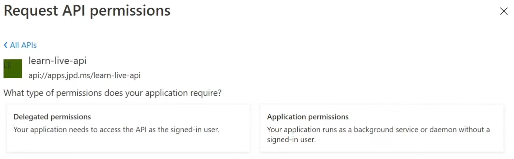

# Microsoft Identity

## Access Token vs. ID Token

OAuth2 protocol is used for **authorization** - to allow apps to get access to
users' resources without having the actual users' credentials to these
resources. Instead, the app gets permission to retrieve an access token that
grants access to some resource.

ID Token is similar, but it's used for **authentication**. Another difference is
that the access tokens are to be used by:

- identity providers (that issue them)
- resources (that give access to some data (or not) based on claims in the
  tokens)

The apps that read that data for the users are not supposed to look into the
access tokens (and they are not the *audience*)! However, they are allowed and
expected to read the ID Tokens to learn who the user is. The actual *audience*
of the ID Token is the app that is supposed to display user's name.

:::tip
Microsoft Identity implements OAuth2 and OpenID Connect standards.
:::

Access Token cannot contain permissions for multiple different services. One
access taken can have multiple permissions, but only in scope of a single
resource.

### Acquiring ID Tokens

ID Tokens are acquired via the Implicit Flow.
[MSDN](https://docs.microsoft.com/en-us/azure/active-directory/develop/v2-protocols-oidc#send-the-sign-in-request)
says that it's necessary to enable ID Tokens in implicit flow in order to
receive ID Tokens when calling the `/authorize` endpoint.

## B2X

### B2B

AAD tenant may invite users that are not part of the organization. Such users
would have *shadow accounts* created for the needs of business cooperation.
Admin of a tenant might manage access of the external users via the shadow
accounts. They may be treated as guest accounts in the organization.

Uing B2B, the app may be a signle-tenancy one. The B2B users are treated as
members of the tenant where they were invited to.

B2B is used for cooperation between businesses when they need to work on a
single project together.

### B2C

It allows federating other identity providers under a single umbrella of AAD
B2C. Without B2C, all users have to use Microsoft accounts. With B2C, the users
can use any OpenId Connect-compliant IdP.

B2C allows heavy customization of user flows. E.g., the sign up/sign in page can
be completely customized, with support for multiple languages, etc.

B2C is used to allow access to our product to users from the world, the actual
customers.

#### API Connectors

B2C allows to define API Connectors - endpoints that will be called by B2C
during user flows. For example, one of my custom user attributes in B2C could be
a nickname. I could have my own rules regarding nicknames and I could configure
B2C to always call my custom API that either allows or disallows the usage of
some nickname.

## Multi-tenant Apps

AAD apps that are multitenant may be logged-into by users from multiple AAD
tenants. Every tenant gets its own service principal entity for that app.

## App Registration vs. Service Principal

There is a concept of **app registration** (client ID) and **service
principal** (service principal ID).

In single-tenant apps these are basically the same thing. There's one app
registration and one service principal of the app in a single tenant.

In multi-tenant apps the concepts are separate. There is one app registration,
but for every tenant that has users accessing the app, there will be a separate
service principal created.

App Registration is like a template for multiple service principals to be
created based on it.

## App Registrations

### App Roles

App roles allow creation of custom roles that the app understands and works
with. These roles can then be assigned to the users of the app (potenaitally
other apps). This way, we can create our own RBAC rules for the app, limiting
what different users can access.

:::tip
An App Role may be restricted to be usable with:
- only users and groups
- only aps
- any of the above
:::

The roles may be applied to users/apps in the Enterprise Applications panel of
AAD. A set of roles would have been created in the app registration. Each tenant
might assign different sets of people to these roles via their own service
principles (my app in their tenant).

Compared to groups, App Roles are a better choice. They are app-specific.

:::tip[Required Roles]
We may restrict our app principals to only be accessible to users that have some
role assigned. If someone without a role tries to get an access token to my app,
they will not get it, authentication will fail. It's done in the Properties pane
of Enterprise Applications entry of my app.

Without it, any user in my tenant can get an access token to my apps. That
access token could be empty, but it's still better to disallow unintended users
if we don't expect anyone in the organization to use the app.
:::

The assigned roles will be available in the access token.

### API Permissions

We can define the allowed set of permissions that the app may ask for. They may
also be consented by the admin of a tenant. With that, individual users of the
app will not be asked for consent.

An app may also ask for permissions "dynamically", so the permission does not
have to be defined in *API Permissions* in AAD. In such a case, the user has to
consent the permission to allow the app to get the requested data.

### Expose an API

Described in [Building a Custom API](#building-a-custom-api)

## Building a Custom API

When building our own API that is going to be the actual resource of data
(protected data), we'd do the following.

The *Authentication* panel in the app's registration would stay empty. This app
will not allow signing-in of users.

### Scopes

We can define the scopes that our API exposes in the *Expose an API* panel of
app registration. These scopes are only for user flows (delegated).

Technically, our API does not have to define any scopes, we could just rely on
the valid access token being delivered, signed by AAD. Scopes allow for
different levels of access to be defined.

When defining a scope, we can specify if that scope requires a consent of an
admin of a tenant. If not, just the user's consent will be enough for client
apps to acquire that permission.

:::caution[Client Credentials]
Scopes are for user flows only. Daemon apps should use [App
Roles](#app-roles).
The roles may be assigned to users in the *API permissions* panel. Since dameon
apps are not interactive, there is no way to use dynamic permissions. All
permissions that the app needs need to be assigned up front.

When requesting a token, a daemon app should ask for the `.default` scope. It
wil return an access token with all of the permissions (app roles) that were
assigned to the app in the AAD portal.

Assigned app roles have to be granted consent by an admin.
:::

:::tip[Scopes vs App Roles]
When assigning scopes/app roles to our apps, the scopes we defined in *Expose an
API* can be found under "Delegated permissions", while the App Roles can be
found under "Application Permissions

:::

## AAD Groups

AAD allows entities to be assigned to groups, similarly to how "old" AD works.
It causes a problem if there is a big amount of groups (> 250 or even less on
implicit flow), because they will not fit into JWT. In such a case the groups
need to be fetched from the Graph API. In organizations being a member of a lot
of groups is typical.

Roles are considered more modern than Groups. **Usage of Groups is
discouraged**, becuase:

- Users are typically assigned to a lot of groups. If there's too many, the
  app has to make a call to Graph API to read groups
    - It might also be undesired to share information about all the groups that
      a user belongs to
- Groups are returned in the token as GUIDs, which is not easy to use in code
(e.g. with the `Authorize` attribute in ASP.NET). Only in the case of AD
Connect-synchronized groups, the names will be delivered.
- Groups are not app-specific, they are global. The token will be huge with
  lots of unneeded information

:::tip[Groups as Roles]
An app registration may be configured (via its Manifest) to include groups as
roles in the ID Token (and access token?).
:::

App Roles may be assigned to AAD groups (on premium plan of AAD).