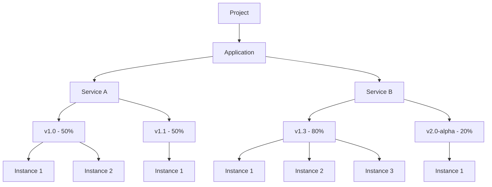

# Google Cloud Overview

## Projects

GCP is organized into **Projects**. Projects may belong to some **Organization**
or not.

Different Projects may be used for Testing and Production. Projects have
separation of data. If we store data within the same Project (e.g. Firestore),
this data is hosted in the same space (instance?).

GCP Projects are a little bit like Resource Groups on Azure.

## CLI

[Google Cloud SDK](https://cloud.google.com/sdk/docs/install-sdk)

The command is `gcloud`. After the installation, we should run `gcloud init` to
log in.

Google Cloud Storage uses the `gsutil`.

`gcloud config` allows us to manage the config of the CLI.

### Cloud Shell

Cloud Shell is available from the Web Console interface. Highlights:

- has preinstalled SDKs (e.g. dotnet)
- allows setting up a web server on some port and accessing it from the outside

## App Engine

It's a GCP's version of Azure's App Service.

A single GCP project may have only one App Engine Application. However, an
Application may have multiple Services, where each service is a different app
(very intuitive (not)).

A Service may have multiple versions, all of them running parallelly. The
traffic may be managed for specific versions (e.g., canary deployment). For
example, feature braches could be deployed as separate versions of a service.

Each version is scalable horizontally.



::: tip Default
By default, when deploying an app to the project, a "default" service name is
chosen.
:::

### URL Template

Each service version can be reached independently:

```
https://{VERSION_ID}-dot-{SERVICE_ID}-dot-{PROJECT_ID}.{REGION_ID}.r.appspot.com
```

Support for .NET seems to be really bad. The [provided
examples](https://github.com/GoogleCloudPlatform/dotnet-docs-samples) are for
.NET Core 2.1. The best option for .NET apps seems to be the "custom" runtime,
which is basically containers.

Any app running on App Engine requires the `app.yaml` file. Here's an example of
it for the "custom" runtime:

```yaml
runtime: custom
env: flex
```

Here's a full ASP.NET Core Web API project example:
[GitHub](https://github.com/marcinjahn/gcp-dotnet-example).

The app can be deployed with `gcloud app deploy app.yaml`

::: tip Port
Apps using runtimes other than "custom" are expected to listed on the port
provided in the `PORT` environment variable. The "custom" Docker apps are
expected to listed on port `8080`.
:::

## SQL

We can deploy managed SQL databases:

- MySQL
- PostgreSQL
- Microsoft SQL Server

## Service Accounts

Service Accounts are identities for applications that need to access GCP. We can
managed their access via roles.

In some cases, GCP creates Service Accounts in the background for us. For
example, App Engine has its own default Service Account. We can manage it.

Service Accounts are assignable to:

- users - a given user can act as this Service Account
- GCP resources - it works like Managed Identity on Azure

## Storage

Google Cloud Storage stores files (**Objects**) in **Buckets**. Similarly to
Azure Storage, we can select a tier (here called **Storage Class**):

- Standard - cheap retreival, expensive storage
- Nearline
- Coldline
- Archive - cheap storage, expensive retrieval

Access may be managed on the Bucket level, or individually for each Object.

**Signed URLs** is something similar to Azure Storage SAS Tokens. It allows to
generate temporary URLs to read/write Objects.

There's also a way to manage Objects' lifetime, similarly to Azure Blog Storage.
Objects may change tier after some configured timespan.

## Cloud Tasks

It's similar to Azure Service Bus, or Azure Storage Queue. Cloud Tasks are
specifically targetted to be used by App Engine apps.

## Cloud Scheduler

It's a CRON-like service that does something on schedule:

- triggers App Engine
- sends pub/sub messages
- invokes some HTTP endpoint

## Monitoring

### Cloud Logging

It works like App Insights in Azure.

We can easily write to a log using the CLI:

```sh
gcloud logging write my-log-instance "A log example"
```

Structured logging is also supported.

App Engine (and other services, such as Functions) are connected to Cloud
Logging, so stdout/stderr goes there automatically.

### Cloud Debugger

It's a web interface that allows us to debug our code. We can see callstack and
variables live as the app is being executed in GCP.

I saw how it works with interpreted language such as JS. What about compiled
languages such as .NET? Debugger gives us a way to upload the source code, so
potentially it is able to synchronize the deployed binary with the source code?

We can even add logs to the running code.

### Cloud Trace

It collects some statistics about our apps (most frequent URLs, latency, etc.).
We can also see detailed information about network activity of our apps,
similarly to how Azure App Insights displays it. We can see consecutive network
calls being executed by our apps.

## References

[LinkedIn Google Cloud Platform Essential Training for
Developers](https://www.linkedin.com/learning/google-cloud-platform-gcp-essential-training-for-developers)