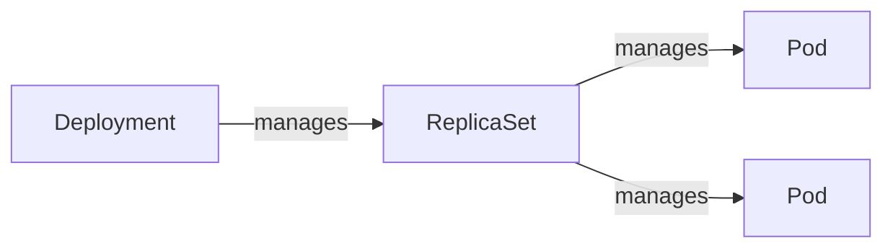

# Scaling

It's not very convenient to manage pods individually. We need ways to deploy
pods in multiple replicas, which is a base for high availability of the service.
Additionally, we need a way to keep pods running in case some node fails.

## ReplicaSet

ReplicaSet allows us to create a group of pod replicas, instead of just one pod.
The pods managed by the ReplicaSet are selected using an immutable label
`selector` (similarly to [Services](./services.md)). There is also a `template`,
which defines the pod(s) that will be created under ReplicaSet. Such a pod has
to conform to the *selector* specified by the ReplicaSet. 

::: tip Existing Pods
If some pods matching the selector already existed prior to the creation of the
ReplicaSet, they're counted as part of the ReplicaSet.

If we manually create some pod(s) that conform to ReplicaSet's selector, the
controller will delete some pods to reach the *replicas* count.
:::

Pod names are generated based on the ReplicaSet's name, but it can be changed
with the `generateName` setting.

::: tip ReplicationController
In the past, ReplicationController was used instead of ReplicaSet. It behaved
the same as ReplicaSet does. It is now deprecated.
:::

ReplicaSets are rarely used directly due to their lacking pods updates
possibilities.

### Updates

We're free to change `replicas` count and the number of pods will reflect the
setting.

If we modify the `template` of some existing ReplicaSet, the existing pods will
not be updated. Instead, just the pods created by ReplicaSet in the future will
have the new settings applied.

### Replacing a Pod

Sometimes we might want to investigate some issue in one of the pods, while
keeping ReplicaSet running with proper scaling. We could temporarily increment
the *replicas* config, but we'd have to rememeber to decrement it back later on.
Instead, we can just change the labels of the faulty pod so that it does not
conform to ReplicaSet's selector. The ReplicaSet's controller will create a new
pod for its needs while we can start investigating the faulty pod.

### Ownership

Pods managed by a ReplicaSet have a special
"ownerReference" section in their "metadata". A pod can have multiple owners.

Pods are auto-deleted when the owners are deleted (unless the `--cascade=orphan`
parameter is applied while removing the owner).

If a pod is taken out of the ReplicaSet (like [this](#replacing-a-pod)) the
"ownerReference" metadata is deleted from it automatically.

## Deployment

Deployments manage Pods via a ReplicaSet. They are mostly used for stateless
workloads. Labels applied in the `template` for Pods are also applied to the
ReplicaSet that manages these pods.



::: tip ReplicaSet Updates
If we try to edit ReplicaSet managed by a Deployment, our updates will be
replaced with Deployment's config soon after. ReplicaSet is controlled by the
Deployment and we should modify its settings throught the Deployment.
:::

In addition to settings available to ReplicaSets, Deployments also contain the
`strategy` configuration. It dictates how Pods are replaced during updates.

::: tip Existing Pods
If some pods already exist that match the Deployment's selector, most likely
they will not be reused in the Deployment's replicas. The ReplicaSet managed by
the Deployment adds additional (based on `template` hash) label selector to
the pods it manages.


:::

### Updates

Compared to ReplicaSets, updating Pod template causes all the existing Pods to
be redeployed to meet the new requirements. Anytime we update Pod's template a
hash of it is calculated, and a new ReplicaSet is created with that hash being
used for one of the selectors.

#### Strategies

There are two update strategies supported by the Deployment:

- **Recreate** - all pods deleted at the same time. There is some downtime until
  the new pods get created. It should be used when downtime is acceptable or
  when apps should not run in mixed versions
- **RollingUpdate** - old pods are gradually replaced with new ones. It's the
  **default**. The number of pods to be replaced at a time is configurable:
    - **maxSurge** - the maximum number of pods above the configured `replicas`
      to be run during the update. The deployment may run more pods than desired
      replicas to keep the app available during the update. It's an absolute
      number or percentage. The default is **25%**.
    - **maxUnavailable** - the max number of Pods (realtive to `replicas`) that
      may be unavailable during the update.It's an absolute number or
      percentage. The default is **25%**.
    
    ::: warning
    We can't set both **maxSurge** and **maxUnavailable** to 0.
    :::

#### Pausing

Pausing might be useful for:

- checking the state of the app in-between the update to see how mixed versions
  work.
- applying multiple update operations without immediate action from the
  deployment-controller.

```sh
# Pause
k rollout pause deployment my-deployment

# Resume
k rollout resume deployment my-deployment
```

#### Rollback

If deployment update rollout is failing, we can rollback with:

```sh
k rollout undo deployment my-deployment
```

If the deployment is paused, rollback will also be paused.

::: warning Only template
Rollback reverts only changes made to the `template` section of the Deployment.
All other changes, such as `strategy` or `replicas` are preserved.

A `k apply` command would overwrite everything.
:::

##### History

We can rollback to older versions as well.

```sh
# To see a list of revisions
k rollout history deploy my-deployment

# To see details of some revision
k rollout history deploy my-deployment --revision 2

# To rollback to some revision
k rollout undo deploy my-deployment --to-revision=2
```

::: tip ReplicaSet
The history of deployments is persisted thanks to the fact that ReplicaSets of
the Deployment are preserved after updates. The amount of old ReplicaSets to
keep is configable with the `spec.revisionHistoryLimit` setting of the
Deployment.
:::

### Restart

We can restart all pods of a deployment with:

```sh
k rollout restart deploy my-deployment
```

All the pods are deleted and replaced with new ones. The `strategy` setting is
respected.

### Example

Creating a simple deployment: `kubectl create deployment kiada
--image=luksa/kiada:0.1`

Kubectl sends a POST request to `/deployments` of K8s API to create a
*Deployment* object. Kubernetes creates a *Pod* object based on Deployment. The
pod is assigned to a Worker Node. Kubelet on a worker node pulls the image and
runs the container.

We can track a deployment with `k rollout status deployment my-deployment`.

### Scaling

`kubectl scale deployment kiada --replicas=3`

It makes sense to skip `replicas` setting from the manifest file of the
deploment. This way, when we reapply the manifest in the future, the `replicas`
setting will not be overwritten to the default again.

### Ownership

Similarly to ReplicaSet, deletion of the Deploymeny auto-removes the ReplicaSet
and the Pods. To circumvent that, we can use the `--cascade=orphan` parameter -
it will preserve both the Pods and ReplicaSet. In such a case, when we recreate
the deployment, the existing ReplicaSet/Pods are reused.

## Pods Deletion

When scaling down, K8s selects pods to delete based on some priorities:

- pods that are not started
- pods collocated on the same node with greater number of replicas
- pods that lived shorter
- pods with a greater number of restarts

We can also influence the priority by applying `pod-deletion-cost` annotation to
specific pods.

## Logs

There is no easy way to display logs from all the pods in a ReplicaSet/Deployment.
Instead, we have to use label selector:

```sh
k logs -l app=myapp --prefix --all-containers
```

- `--prefix` prefixes each log with the container that it came from
- `--all-containers` displays logs from all containers of the pods

## Strategies of deployment

Here're the popular deployment strategies. Some of them are supported by K8s
out-of-the-box, some are not.

- **Recreate** - remove all pods, create all new pods
- **Rolling update** - gradually replace pods
- **Canary** - replace a small number of pods, if the new ones work well, replace the rest
- **A/B testing** - create a small number of new pods, redirect some users
  (based on some condition) to the new pods.
- **Blue/Green** - deploy new pods in parallel with the old ones. When the new
  ones are ready, switch all the traffic to the new ones. Then delete the old
  Pods.
- **Shadowing** - deploy new pods in parallel with the old ones. Route all user
  traffic to both versions, but return to the users just the responses from the
  old version. In the meanitme, observe the responses from the new ones to make
  sure that they work as expected.

Only the first two strategies are supported by K8s. The other strategies require
some manual work.

### Canary

We can create a separate deployment with the new version and scale it to low
number of replicas. The labels of the new pods should match the `selector` of
the Service that was used for the old version. This way, the new pods are added
to the pool ofw pods behind the service. If we see that the new version works, we
can go ahead and update the old deployment and delete the canary one.

### A/B Testing

Some Ingress controllers have this capability.

### Blue/Green

We create a separate deployment with the new versions (Green). We do not route
any traffic at these. All the traffic still hits the old deployment (Blue). When
we're ready, we'd change the `selector` of the Service to match the label
configured in the Green deployment. Then, we delete the Blue deployment.

::: tip
We could use label values "green" and "blue" and switch from one to another in
consecutive updates. So, first we'd start with "blue" and swith to "green". With
some next update we'd switch from "green" to "blue". And so on.
:::